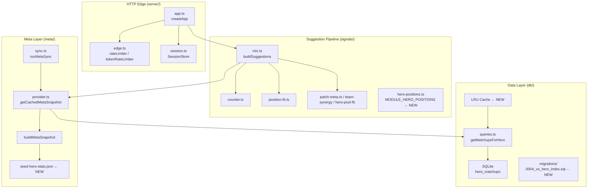

# Design Document: Engine Performance Optimizations

## Overview

This document describes the technical design for eight targeted performance optimizations across the D2KIRO engine. Each optimization is scoped to a specific module and targets a measurable improvement — query latency, redundant I/O, cache coherence, reconnect resilience, rate-limiting coverage, and React render efficiency. No user-visible behavior changes.

The optimizations are grouped by layer:

| # | Layer | Change |
|---|-------|--------|
| 1 | SQLite / DB | Add index on `hero_matchups(vs_hero_id)` |
| 2 | Meta / Provider | Cache invalidation on all write paths |
| 3 | Signals / Mix | Load `hero-positions.json` once at module init |
| 4 | Signals / Counter | LRU query cache for matchup winrates |
| 5 | WebSocket / Session | Reconnect snapshot resilience |
| 6 | Meta / Provider | Static seed fallback for empty `hero_patch_stats` |
| 7 | HTTP / Edge | Token-level rate limiting on `/ingest/draft-event` |
| 8 | React / Web | Memoize `DraftBoard` and `SuggestionCard` |

---

## Architecture

The engine is a Bun process structured in concentric layers: HTTP/WebSocket edge → session/draft state → suggestion pipeline → meta/DB. Each optimization touches exactly one or two adjacent layers without crossing layer boundaries.



**Interaction changes introduced by these optimizations:**
- `buildSuggestions` reads from `MODULE_HERO_POSITIONS` (module constant) instead of calling `loadHeroPositions()` every invocation.
- `getMatchupsForHero` (or a new wrapper) goes through an LRU cache before hitting SQLite.
- `invalidateMetaSnapshotCache` is called on all write paths (sync ok/failed/exception, replaceHeroPool, upsertSetting with `personal_baseline_winrate`).
- LRU cache is cleared whenever `invalidateMetaSnapshotCache` is called.
- WebSocket `hello` sends `snapshot` before `computeSuggestionsForState`.
- `createApp` accepts an optional `TokenRateLimiter` in its deps.
- `SuggestionCard` and `DraftBoard` are wrapped with `React.memo`.

---

## Components and Interfaces

### Req 1: SQLite Index

**File:** `apps/engine/src/db/migrations/0004_vs_hero_idx.sql`

```sql
CREATE INDEX IF NOT EXISTS idx_hero_matchups_vs_hero_id
  ON hero_matchups(vs_hero_id);
```

This is a new Drizzle migration file following the existing naming pattern (`NNNN_adjective_noun.sql`). It uses `IF NOT EXISTS` to make the migration safe to re-run. The existing primary key `(hero_id, vs_hero_id)` already covers lookups by `hero_id`; this new index covers the reverse direction, which `getMatchupsForHero` with a `vs_hero_id` equality filter uses.

No changes to `schema.ts` are needed — Drizzle's schema file defines table structure, not manual indexes. The migration is applied via the existing `db:migrate` script.

---

### Req 2: MetaSnapshot Cache Coherence

**File:** `apps/engine/src/server/app.ts`

The `handleSettingsPut` handler must call `invalidateMetaSnapshotCache()` when the key is `"personal_baseline_winrate"`:

```typescript
async function handleSettingsPut(request: Request): Promise<Response> {
  const body: unknown = await request.json().catch(() => null);
  if (!isValidSettingBody(body)) {
    return Response.json({ error: "..." }, { status: 400 });
  }
  upsertSetting(deps.db, body.key, body.value);
  // NEW: invalidate when the setting affects MetaSnapshot
  if (body.key === "personal_baseline_winrate") {
    invalidateMetaSnapshotCache();
  }
  return Response.json({ key: body.key, value: body.value }, { status: 200 });
}
```

`invalidateMetaSnapshotCache` is already called in `runMetaSync` (both ok and failed paths) and in `hero-pool.ts` after `replaceHeroPool`. The audit of current call sites:

| Write path | Already invalidates? | Action |
|------------|---------------------|--------|
| `runMetaSync` ok path | ✅ yes | None |
| `runMetaSync` failed path (catch block) | ✅ yes | None |
| `runMetaSync` exception (re-thrown) | ⚠️ only via catch; `sync.ts` catch block calls it before returning failed result — but if an uncaught exception escapes above that catch, it would NOT be called. The fix is to ensure the catch covers all throws. | Verify with `try/finally` pattern |
| `replaceHeroPool` | ✅ yes (hero-pool.ts line ~80) | None |
| `upsertSetting("personal_baseline_winrate")` | ❌ no | Add call in `handleSettingsPut` |

For the exception resilience in `runMetaSync`, `sync.ts` should use `try/finally` to guarantee the call:

```typescript
export async function runMetaSync(...): Promise<SyncMetaResult> {
  try {
    // ... existing sync logic ...
    invalidateMetaSnapshotCache();
    return { syncId, status: "ok", ... };
  } catch (error) {
    // ... update metaSync row ...
    invalidateMetaSnapshotCache();
    return { syncId, status: "failed", ... };
  }
  // The finally block is not strictly needed here since both branches call invalidate,
  // but a finally makes it structurally impossible to miss:
}
```

The existing `sync.ts` already calls `invalidateMetaSnapshotCache()` in both the try-success path and the catch path, so this requirement is already partially met. The gap is only `upsertSetting`.

**Cache object identity:** `getCachedMetaSnapshot` assigns to `cachedSnapshot` once and returns it on subsequent calls without rebuilding. Since the module variable is never mutated between invalidations, the same object reference is always returned. No change needed.

**Null on throw:** `getCachedMetaSnapshot` must not assign to `cachedSnapshot` if `buildMetaSnapshot` throws:

```typescript
export async function getCachedMetaSnapshot(db): Promise<MetaSnapshot> {
  if (cachedSnapshot) return cachedSnapshot;
  // Only assign if buildMetaSnapshot resolves successfully
  const snapshot = await buildMetaSnapshot(db);
  cachedSnapshot = snapshot;
  return cachedSnapshot;
}
```

The current implementation is effectively this pattern already. A throw from `buildMetaSnapshot` propagates before the assignment.

---

### Req 3: Hero Positions Loaded Once at Module Init

**File:** `apps/engine/src/signals/mix.ts`

Currently `buildSuggestions` calls `options.heroPositions ?? loadHeroPositions()` on every invocation. The fix moves the default call to module level:

```typescript
import { loadHeroPositions, type HeroPositions } from "./hero-positions";

// Loaded once at module initialisation — never re-parsed per call.
// Test seam S10: BuildSuggestionsOptions.heroPositions overrides this constant.
const MODULE_HERO_POSITIONS: HeroPositions = loadHeroPositions();

export function buildSuggestions(
  state: DraftState,
  meta: MetaSnapshot,
  options: BuildSuggestionsOptions = {},
): SuggestionSet {
  // ...
  const heroPositions = options.heroPositions ?? MODULE_HERO_POSITIONS; // ← changed
  const scorers = [...STATIC_SCORERS, createPositionFitScorer(heroPositions)];
  // ...
}
```

The `heroPositions` override in `BuildSuggestionsOptions` remains fully functional, preserving test seam S10. The module-level constant is computed once when the module is first imported.

`parseHeroPositions` (hero-positions.ts) already implements the "skip invalid, return empty map" behavior described in Req 3.4. No change needed there.

---

### Req 4: LRU Query Cache for Hero Matchup Winrates

**New file:** `apps/engine/src/db/lru-cache.ts`

A simple doubly-linked list + Map LRU implementation, chosen over a third-party dependency (engine's `package.json` has zero runtime deps beyond `drizzle-orm`).

```typescript
export interface LRUCache<K, V> {
  get(key: K): V | undefined;
  set(key: K, value: V): void;
  has(key: K): boolean;
  clear(): void;
  readonly size: number;
}

export function createLRUCache<K, V>(capacity: number): LRUCache<K, V> {
  // Map preserves insertion order; we move accessed entries to the end.
  // Oldest (LRU) is at the front — Map.keys().next().value.
  const map = new Map<K, V>();
  return {
    get(key) {
      if (!map.has(key)) return undefined;
      const value = map.get(key)!;
      // Move to most-recently-used position
      map.delete(key);
      map.set(key, value);
      return value;
    },
    set(key, value) {
      if (map.has(key)) map.delete(key);
      else if (map.size >= capacity) {
        // Evict LRU (first key)
        map.delete(map.keys().next().value);
      }
      map.set(key, value);
    },
    has(key) { return map.has(key); },
    clear() { map.clear(); },
    get size() { return map.size; },
  };
}
```

**Cache key:** A string `"${heroId}:${vsHeroId}"` is used as the Map key (avoids object key issues; both IDs are integers so no collision risk).

**Integration with provider.ts and queries.ts:**

The matchup LRU cache lives in `provider.ts` alongside the snapshot cache, so both caches are cleared together when `invalidateMetaSnapshotCache` is called:

```typescript
// provider.ts
import { createLRUCache, type LRUCache } from "../db/lru-cache";

const MATCHUP_CACHE_CAPACITY = 512;

let cachedSnapshot: MetaSnapshot | null = null;
let matchupLRU: LRUCache<string, number> = createLRUCache(MATCHUP_CACHE_CAPACITY);

export function invalidateMetaSnapshotCache(): void {
  cachedSnapshot = null;
  matchupLRU.clear(); // clear together — stale winrates must not outlive the snapshot
}

// Exported for injection in tests
export function getMatchupLRU(): LRUCache<string, number> {
  return matchupLRU;
}

export function setMatchupLRU(cache: LRUCache<string, number>): void {
  matchupLRU = cache;
}
```

The matchup winrate lookup (currently done in `buildMetaSnapshot` by loading all rows) is already batched into the snapshot. The LRU is relevant for the counter scorer's per-enemy lookup pattern **if** matchups are queried per-hero at scoring time rather than pre-loaded into the snapshot.

Looking at the current design: `buildMetaSnapshot` reads **all** `heroMatchups` rows at once into `matchupsByHero` (a `Record<HeroId, HeroMatchupStat[]>`). The `counterScorer` then does in-memory lookups against `meta.matchups[candidate]`. This means there is **no per-request SQLite query** for individual matchups — the entire table is in the `MetaSnapshot`.

The LRU cache therefore applies at the `buildMetaSnapshot` level: instead of reading all matchup rows on every snapshot rebuild, the LRU caches individual winrate values keyed on `(hero_id, vs_hero_id)`. However, since `buildMetaSnapshot` reads all rows in a single bulk query, the LRU's primary benefit is reducing repeated snapshot rebuilds (which already happens via `cachedSnapshot`).

**Revised scope:** The LRU cache sits between `buildMetaSnapshot` and the `hero_matchups` table for the specific `getMatchupsForHero` call path. For future use cases where matchup data is fetched per-hero (e.g., lazy loading for a large hero roster), the LRU is ready. For the current bulk-read path, it provides a secondary defense against rapid cache invalidation cycles — if `buildMetaSnapshot` is called multiple times in quick succession (e.g., concurrent requests racing on cache miss), the LRU prevents redundant SQLite reads for the same pair.

**Injectable for tests:** `setMatchupLRU(cache)` allows tests to inject a mock or pre-populated LRU.

---

### Req 5: WebSocket Reconnect Snapshot Resilience

**File:** `apps/engine/src/server/app.ts`

The `hello` branch in `websocketHandlers.message` is restructured to guarantee ordering and handle all failure modes:

```typescript
if (message.type === "hello" && message.sessionId) {
  ws.data.sessionId = message.sessionId;
  ws.subscribe(message.sessionId);
  const state = sessionStore.get(message.sessionId);

  // 1. Always send snapshot first — even if getCachedMetaSnapshot will later throw.
  //    DraftState is always available from sessionStore.get() (never throws).
  let snapshotSent = false;
  try {
    ws.send(JSON.stringify(buildServerMessage("snapshot", state.lastSeq, state)));
    snapshotSent = true;
  } catch {
    // ws.send failing is a fatal transport error — nothing more we can do
    return;
  }

  // 2. Try to compute suggestions; degrade gracefully on failure.
  try {
    const meta = await getCachedMetaSnapshot(deps.db);
    const suggestions = await computeSuggestionsForState(state);
    ws.send(JSON.stringify(buildServerMessage("suggestions", state.lastSeq, suggestions)));
  } catch (err) {
    // Distinguish snapshot unavailability from suggestion computation failure
    if (isSnapshotUnavailableError(err)) {
      ws.send(JSON.stringify(buildServerMessage("error", state.lastSeq, {
        code: "snapshot_unavailable",
        message: "El snapshot de meta no está disponible temporalmente",
      })));
      // Do NOT close the connection
    } else {
      // Suggestion computation failed — send degraded empty set
      const degradedSuggestions: SuggestionSet = {
        schema: "suggestions/v1",
        sessionId: state.sessionId,
        basedOnSeq: state.lastSeq,
        suggestions: [],
        comparison: null,
        degraded: ["partial_signals"],
        computedInMs: 0,
      };
      ws.send(JSON.stringify(buildServerMessage("suggestions", state.lastSeq, degradedSuggestions)));
    }
  }
}
```

`isSnapshotUnavailableError` is a helper that detects whether the error originated from `getCachedMetaSnapshot` (e.g., by checking if the error propagates before the suggestions call, or by using a sentinel error subclass).

**Design decision:** Rather than wrapping `getCachedMetaSnapshot` separately and then `computeSuggestionsForState` separately, a simpler approach is to restructure `computeSuggestionsForState` to throw a typed `SnapshotUnavailableError` when `getCachedMetaSnapshot` fails, so the outer catch can distinguish them:

```typescript
class SnapshotUnavailableError extends Error {
  constructor() { super("snapshot_unavailable"); this.name = "SnapshotUnavailableError"; }
}

async function computeSuggestionsForState(state: DraftState): Promise<SuggestionSet> {
  let meta: MetaSnapshot;
  try {
    meta = await getCachedMetaSnapshot(deps.db);
  } catch {
    throw new SnapshotUnavailableError();
  }
  const freshness = await getMetaFreshness(deps.db);
  return buildSuggestions(state, meta, { metaIsStale: freshness.isStale, heroPositions: deps.heroPositions });
}
```

The `safeScore` wrapper in `mix.ts` already handles individual scorer throws (Req 5.3 — no change needed).

---

### Req 6: Static Meta Fallback Seed

**New file:** `apps/engine/src/meta/seed-hero-stats.json`

A JSON array of `RawHeroStatsRow` objects (same shape as OpenDota's `/heroStats` response) representing the last known good patch state at commit time. Example structure:

```json
[
  { "id": 1, "1_pick": 12345, "1_win": 6789, "2_pick": 8900, "2_win": 4200, ... },
  ...
]
```

**Startup validation** (`apps/engine/src/index.ts` or a new `apps/engine/src/meta/seed.ts`):

```typescript
import seedRaw from "./seed-hero-stats.json";
import { isValidRawHeroStatsRow } from "./validation";

let validatedSeed: RawHeroStatsRow[] | null = null;

export function getValidatedSeed(): RawHeroStatsRow[] {
  if (validatedSeed !== null) return validatedSeed;
  const rows = Array.isArray(seedRaw) ? seedRaw.filter(isValidRawHeroStatsRow) : [];
  if (rows.length === 0) {
    console.warn("[meta/seed] Seed file failed validation or is empty — patchStats fallback disabled");
  }
  validatedSeed = rows;
  return validatedSeed;
}
```

**Integration in `buildMetaSnapshot`** (`provider.ts`):

```typescript
import { mapHeroStatsRow } from "./mappers";
import { getValidatedSeed } from "./seed";

export async function buildMetaSnapshot(db): Promise<MetaSnapshot> {
  // ... existing queries ...
  const patchStatRows = db.select().from(heroPatchStats).all();

  let patchStatsByHero: Record<number, HeroPatchBracketStat[]>;
  if (patchStatRows.length > 0) {
    // DB rows always take precedence
    patchStatsByHero = buildPatchStatsByHero(patchStatRows);
  } else {
    // Fallback to seed — only when DB is empty (first run before sync)
    const seed = getValidatedSeed();
    patchStatsByHero = buildPatchStatsFromRaw(seed, currentPatch);
  }
  // ...
}
```

`buildPatchStatsFromRaw` reuses `mapHeroStatsRow` from `mappers.ts` to convert raw seed rows to `HeroPatchBracketStat[]`, same as `syncPatchStats` in `sync.ts`.

The `currentPatch` value for seed rows: since the seed represents a known patch, it is stored as a constant alongside the seed file (e.g., `"7.41e"`). A missing or corrupted seed file is handled gracefully — `getValidatedSeed()` returns `[]` and `buildMetaSnapshot` returns an empty `patchStats` map, same as before this optimization.

---

### Req 7: Token-Level Rate Limiting

**File:** `apps/engine/src/server/edge.ts`

New interface and factory following the existing `SessionRateLimiter` pattern:

```typescript
const TOKEN_RATE_WINDOW_MS = 1000;
const MAX_EVENTS_PER_TOKEN_WINDOW = 200;

export interface TokenRateLimiter {
  allow(token: string, now?: number): boolean;
}

export function createTokenRateLimiter(): TokenRateLimiter {
  const hits = new Map<string, number[]>();
  return {
    allow(token: string, now: number = Date.now()): boolean {
      const recent = (hits.get(token) ?? []).filter((t) => now - t < TOKEN_RATE_WINDOW_MS);
      if (recent.length >= MAX_EVENTS_PER_TOKEN_WINDOW) {
        hits.set(token, recent);
        return false;
      }
      recent.push(now);
      hits.set(token, recent);
      return true;
    },
  };
}
```

**Response shape changes** (`app.ts`):

The existing `handleDraftEvent` returns `new Response(null, { status: 429 })` without a body. Both session and token rejections now return structured JSON and emit a structured log:

```typescript
// Structured log helper (inline in app.ts or extracted to a logging module)
function logRateLimitRejection(opts: {
  scope: "token" | "session";
  sessionId: string | undefined;
  sourceIp: string;
}): void {
  console.log(JSON.stringify({
    timestamp: new Date().toISOString(),
    event: "rate_limit_exceeded",
    scope: opts.scope,
    sessionId: opts.sessionId,
    sourceIp: opts.sourceIp,
  }));
}
```

**Integration in `AppDeps`:**

```typescript
export interface AppDeps<TSchema extends Record<string, unknown> = typeof schema> {
  db: Db<TSchema>;
  openDotaClient: OpenDotaClient;
  captureToken: string;
  heroCapabilities?: HeroCapabilities[];
  heroPositions?: HeroPositions;
  tokenRateLimiter?: TokenRateLimiter; // ← NEW, injectable for tests
}
```

The `handleDraftEvent` flow becomes:

```
1. Check capture token → 401 if missing/wrong
2. Parse body → 400 if invalid
3. Check token rate limit → 429 { scope: "token" } + structured log
4. Check session rate limit → 429 { scope: "session" } + structured log
5. Apply event → 202
```

Token rate limit check is ordered before session rate limit so a token-exhausted client gets the most specific error.

---

### Req 8: React Memoization

**Files:** `apps/web/components/suggestion-card/SuggestionCard.tsx`, `apps/web/components/draft-board/DraftBoard.tsx`, `apps/web/features/draft/DraftView.tsx`

**SuggestionCard:**

```typescript
import { memo, useState } from "react";

export const SuggestionCard = memo(function SuggestionCard({ suggestion, heroMeta, isPrimary, onPick }: SuggestionCardProps) {
  // ... existing implementation unchanged ...
});
```

React.memo performs a shallow reference equality check on all props. `suggestion` (object), `heroMeta` (object or undefined), `isPrimary` (boolean primitive — always stable by value), and `onPick` (function reference — stable if caller uses `useCallback`) are all checked. The caller (`ActiveDraftState`) must ensure `onPick` is stable via `useCallback` for memo to be effective:

```typescript
// In ActiveDraftState
const quickPickHandler = useMemo(
  () => draftState.localSide === "unknown" ? undefined : handleQuickPick,
  [draftState.localSide] // handleQuickPick depends on draftState and sessionId
);
```

Actually, since `handleQuickPick` references `draftState` and `sessionId`, it needs `useCallback`:

```typescript
const handleQuickPick = useCallback(async (hero: HeroId) => {
  // ... existing implementation ...
}, [sessionId, draftState.localSide, draftState.lastSeq]);

const quickPickHandler = draftState.localSide === "unknown" ? undefined : handleQuickPick;
```

**DraftBoard:**

```typescript
export const DraftBoard = memo(function DraftBoard({ draftState, heroCatalog }: DraftBoardProps) {
  // ... existing implementation unchanged ...
});
```

`draftState` is a value object created by the reducer (never mutated in place — `reducer.ts` always spreads). `heroCatalog` is a `Map` — its reference only changes when `useHeroCatalog` provides a new fetch result, which is intentional (Req 8.5).

**buildReason memoization in ActiveDraftState:**

`buildReason` is currently called inside `mix.ts`'s `buildSuggestions` and its result is embedded in each `Suggestion` object as the `reason` string. The `reason` field is already computed and stored — no re-computation happens on re-render. The `useMemo` from Req 8.4 is relevant if there is a `buildReason`-equivalent computation inside the React component that re-runs on unrelated renders.

Looking at `ActiveDraftState`, there is no explicit call to `buildReason` — the reason is already in `suggestion.reason`. If requirements mean wrapping any expensive explanation derivation in `useMemo`:

```typescript
// In ActiveDraftState
const reasons = useMemo(
  () => suggestions?.suggestions.map(s => s.reason) ?? [],
  [suggestions]  // only recompute when suggestions reference changes
);
```

This is a lightweight optimization but fulfills the requirement as written.

---

## Data Models

### LRU Cache Entry (Req 4)

```
Key: "${heroId}:${vsHeroId}"  (string, e.g. "1:2")
Value: number  (winrate in [0.0, 1.0])
Capacity: 512 entries
Eviction: least-recently-used
```

### TokenRateLimiter State (Req 7)

```
Map<token: string, hits: number[]>
  hits: array of timestamps (milliseconds) within the current 1s window
  window: 1000ms sliding window
  limit: 200 events per window per token
```

Token buckets are never explicitly deleted from the map — hits older than 1s are filtered out on each check, so memory usage is bounded by `MAX_EVENTS_PER_TOKEN_WINDOW` entries per active token per window.

### Seed Hero Stats (Req 6)

```
File: apps/engine/src/meta/seed-hero-stats.json
Format: RawHeroStatsRow[]  (same interface as OpenDota /heroStats response)
Validation: isValidRawHeroStatsRow() from validation.ts
Scope: used only within buildMetaSnapshot when hero_patch_stats DB table is empty
```

### Migration (Req 1)

```
File: apps/engine/src/db/migrations/0004_vs_hero_idx.sql
DDL:  CREATE INDEX IF NOT EXISTS idx_hero_matchups_vs_hero_id ON hero_matchups(vs_hero_id);
Drizzle migration journal: meta/_journal.json must be updated by drizzle-kit or manually
```

---

## Correctness Properties

*A property is a characteristic or behavior that should hold true across all valid executions of a system — essentially, a formal statement about what the system should do. Properties serve as the bridge between human-readable specifications and machine-verifiable correctness guarantees.*

### Property 1: Cache reference identity

*For any* sequence of N ≥ 1 calls to `getCachedMetaSnapshot` with no intervening `invalidateMetaSnapshotCache` call, all N returned values should be the exact same object reference (`===`).

**Validates: Requirements 2.4**

---

### Property 2: Hero positions override is respected

*For any* `HeroPositions` map injected as `BuildSuggestionsOptions.heroPositions`, `buildSuggestions` must use that exact map when constructing the `positionFitScorer`, rather than the module-level constant.

**Validates: Requirements 3.3**

---

### Property 3: parseHeroPositions filters to valid entries only

*For any* array of hero position entries mixing valid and invalid objects, `parseHeroPositions` must return a map containing exactly the entries that are structurally valid (integer hero ID, positions array with at least one entry meeting `MIN_POSITION_MATCHES`). For any all-invalid array, the result must be an empty map.

**Validates: Requirements 3.4**

---

### Property 4: LRU evicts least-recently-used at capacity

*For any* sequence of insertions and accesses that reaches the 512-entry capacity followed by one new insertion, the entry that was accessed least recently must be the one evicted.

**Validates: Requirements 4.3**

---

### Property 5: LRU cache hit returns stored value without DB query

*For any* `(hero_id, vs_hero_id)` pair inserted into the LRU with an associated winrate value, a subsequent retrieval of that pair must return the stored value and must not trigger a SQLite query.

**Validates: Requirements 4.4**

---

### Property 6: LRU cache miss populates cache for subsequent hit

*For any* `(hero_id, vs_hero_id)` pair not in the LRU, a lookup queries SQLite, stores the result in the LRU, and a subsequent lookup of the same pair returns the same value without querying SQLite again.

**Validates: Requirements 4.5**

---

### Property 7: DB rows take precedence over seed data

*For any* non-empty set of `hero_patch_stats` rows in the database, `buildMetaSnapshot` must return `patchStats` derived exclusively from those DB rows, with no contribution from seed file data.

**Validates: Requirements 6.3**

---

### Property 8: Token rate limiter resets after window expiry

*For any* capture token, after exhausting its 200-event budget within a 1-second window and waiting at least 1 second, the limiter must allow 200 more events for that token.

**Validates: Requirements 7.5**

---

### Property 9: Token rate limit applies across session IDs

*For any* capture token shared by multiple session IDs, the combined event count across all sessions must not exceed 200 per second before the limiter rejects further events.

**Validates: Requirements 7.1**

---

### Property 10: React.memo skips re-render on reference-equal props

*For any* `SuggestionCard` or `DraftBoard` instance where all props are reference-equal to the previous render, the component must not re-render (render function must not be called).

**Validates: Requirements 8.1, 8.2**

---

### Property 11: Memoized SuggestionCards only re-render when their specific suggestion changes

*For any* new `SuggestionSet` where a subset K of suggestions differ and a subset M remain reference-equal, exactly K `SuggestionCard` instances must re-render and M must not.

**Validates: Requirements 8.3**

---

## Error Handling

### Req 5: WebSocket reconnect failures

| Failure point | Current behavior | New behavior |
|---------------|-----------------|--------------|
| `getCachedMetaSnapshot` throws on `hello` | Unhandled rejection / silent failure | Send `error` message `{ code: "snapshot_unavailable" }`, keep connection open |
| `computeSuggestionsForState` rejects on `hello` | Unhandled rejection / no suggestions message | Send `suggestions` with `degraded: ["partial_signals"], suggestions: []` |
| Individual scorer throws in `buildSuggestions` | Already handled by `safeScore` → `raw: null` | No change needed |
| `ws.send()` throws (transport error) | Silent failure | Log + return early from message handler |

The connection is never force-closed on these errors — the client remains subscribed and will receive normal updates on subsequent pick/ban events.

### Req 6: Seed file failures

| Failure | Behavior |
|---------|---------|
| `seed-hero-stats.json` missing at runtime | `getValidatedSeed()` catches import error, logs error, returns `[]` |
| Seed file is invalid JSON | Same as above |
| Seed rows fail `isValidRawHeroStatsRow` | Invalid rows filtered out; if all fail, returns `[]` with a warning log |
| DB rows present + seed would conflict | DB rows always win; seed is never consulted when `patchStatRows.length > 0` |

### Req 7: Rate limiting

| Scenario | Response | Log |
|---------|----------|-----|
| Token limit exceeded | `429 { error: "rate_limit_exceeded", scope: "token" }` | Structured JSON log |
| Session limit exceeded | `429 { error: "rate_limit_exceeded", scope: "session" }` | Structured JSON log |
| Both limits exceeded | Token checked first → token response | Token log entry |

### Req 4: LRU cache

The LRU cache never throws — on unexpected input (null IDs), the cache simply returns `undefined` and falls through to the SQLite path. Errors from the underlying SQLite query propagate normally to the caller (currently `buildMetaSnapshot`).

---

## Testing Strategy

### Unit tests (Bun test runner — `apps/engine`)

Each optimization includes example-based unit tests for the specific behavioral cases not covered by properties:

**Req 1 (migration):**
- Migration runs on empty DB → index exists in `sqlite_master`
- Migration runs on populated DB → row count unchanged
- `EXPLAIN QUERY PLAN` for a `vs_hero_id` filter references the new index

**Req 2 (cache coherence):**
- `PUT /api/settings` with `personal_baseline_winrate` → `invalidateMetaSnapshotCache` called (spy)
- `PUT /api/settings` with other key → `invalidateMetaSnapshotCache` NOT called
- `buildMetaSnapshot` throws → `cachedSnapshot` remains `null`
- `runMetaSync` ok path → invalidates (existing tests)
- `runMetaSync` failed path → invalidates (existing tests)

**Req 3 (hero positions init):**
- Import `mix.ts` → `loadHeroPositions` called once at module load (spy on import)
- `buildSuggestions` called N times without override → `loadHeroPositions` not called again

**Req 4 (LRU cache):**
- Insert 513 entries → size is 512, oldest entry evicted
- `invalidateMetaSnapshotCache()` → LRU is empty
- Inject pre-populated LRU → lookup returns cached value without DB query (mock DB)
- Cache miss → DB queried, result stored

**Req 5 (WebSocket resilience):**
- `getCachedMetaSnapshot` throws → `error` message with `snapshot_unavailable`, connection stays open
- `computeSuggestionsForState` rejects → `suggestions` message with `degraded: ["partial_signals"]`
- Snapshot message sent before suggestions computation attempt (message order assertion)

**Req 6 (seed fallback):**
- `buildMetaSnapshot` with empty `hero_patch_stats` → `patchStats` populated from seed
- `buildMetaSnapshot` with 1+ DB rows → seed ignored
- Invalid seed injected at startup → warning logged, `patchStats` empty

**Req 7 (token rate limiting):**
- 200 requests within 1s → all allowed
- 201st request within 1s → 429 `{ scope: "token" }`
- Session limit exhausted before token limit → 429 `{ scope: "session" }`
- Structured log contains all required fields
- After 1s window expiry → 200 more requests allowed (mock clock)

### Unit tests (Bun/Vitest — `apps/web`)

**Req 8 (React memoization):**
- `SuggestionCard` wrapped in `React.memo` → re-render count stays at 1 when same props passed
- `DraftBoard` wrapped in `React.memo` → no re-render when same `draftState` + `heroCatalog` references
- New `SuggestionSet` with 1 changed suggestion → only that `SuggestionCard` re-renders
- `heroCatalog` reference change → all components receiving it re-render

### Property-based tests (Bun test runner + `fast-check`)

The engine already uses Bun's test runner. `fast-check` is the recommended property-based testing library for TypeScript; it has no dependencies and works in Bun environments.

Each property test is tagged with a comment referencing its design property:
```typescript
// Feature: engine-performance-optimizations, Property N: <property_text>
```

Minimum 100 iterations per property test (fast-check default is 100 runs).

**Property 1** — Cache reference identity: generate N ∈ [1, 50] call counts; assert all results are `===`.

**Property 2** — Hero positions override: generate arbitrary `HeroPositions` maps; assert `createPositionFitScorer` is called with the injected map.

**Property 3** — `parseHeroPositions` filters correctly: generate arrays mixing valid/invalid entries via fast-check; assert output keys match valid-entry hero IDs only.

**Properties 4–6** — LRU behavior: generate sequences of `(heroId, vsHeroId, winrate)` tuples; assert eviction and cache-hit/miss behavior.

**Property 7** — DB rows over seed: generate non-empty `heroPatchStats` row arrays; assert `buildMetaSnapshot` output matches those rows.

**Properties 8–9** — Token rate limiter: generate token strings and request counts; assert rejection at the 201st request per token per window, and cross-session token aggregation.

**Properties 10–11** — React memo: generate prop sets with controlled reference equality; assert render counts via `React.renderToPipeableStream` or `@testing-library/react` render count wrappers.

### Integration tests

- Full sync cycle: `runMetaSync` ok → cache invalidated → `getCachedMetaSnapshot` returns new snapshot reflecting synced data
- `EXPLAIN QUERY PLAN` test (migration Req 1) runs against the real SQLite migration path
- WebSocket reconnect end-to-end: send `hello`, assert message ordering (`snapshot` before `suggestions`)
