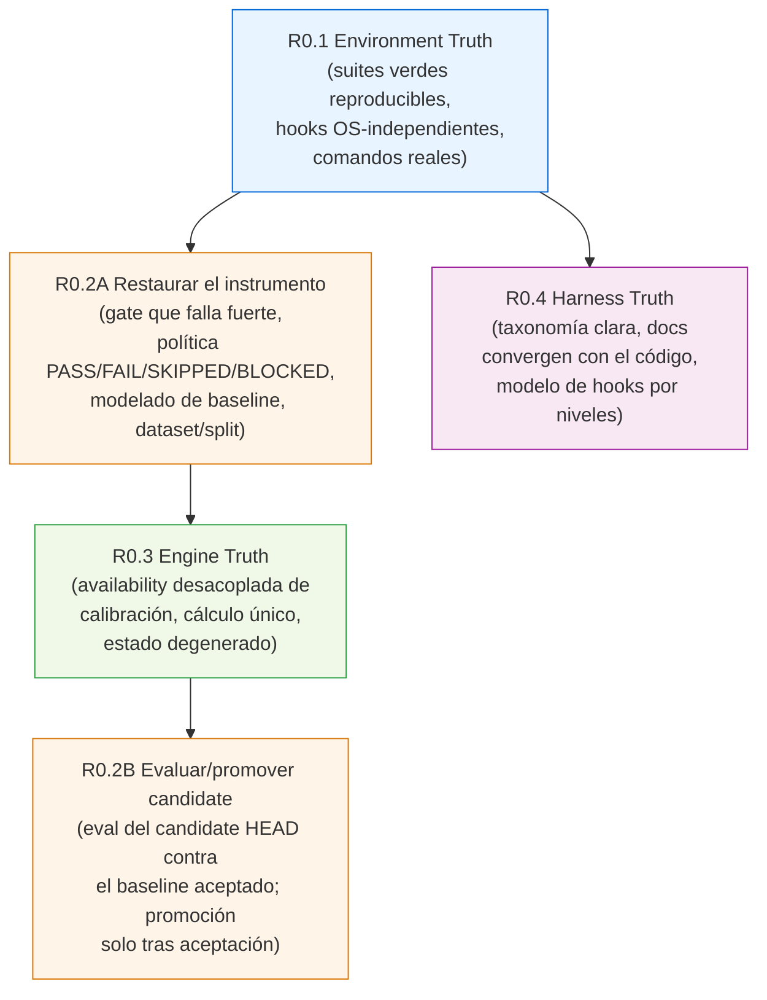
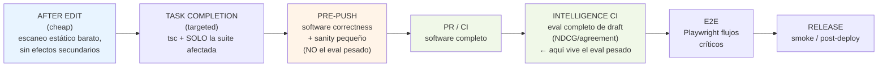
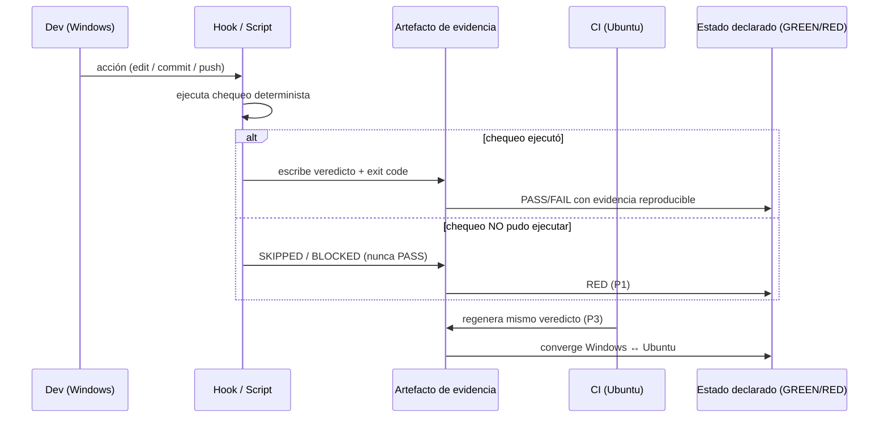
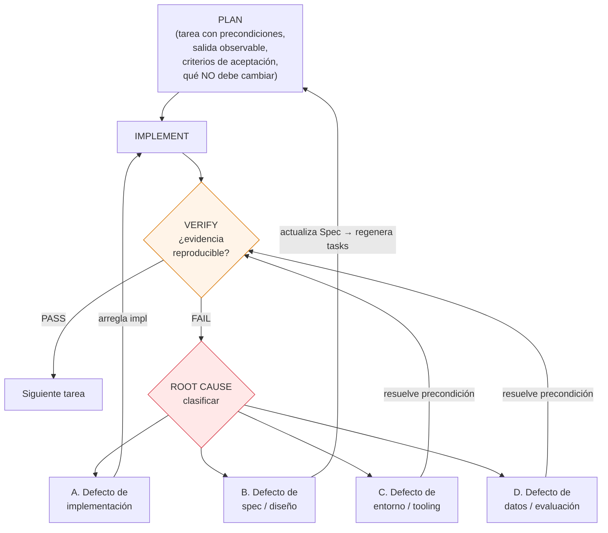

# Documento de Diseño: R0 — Restablecimiento del Baseline de Ingeniería

> Fase de **recuperación** (brownfield) sobre D2KIRO / dota2coach en el commit `d617ba5`.
> Este documento es solo diseño, para revisión previa a Requirements y Tasks.
> No implementa código, no modifica código de producto, no ejecuta tareas.

---

## Overview

_(Sección 1 — Overview y No-Objetivos)_

### 1.1 Qué es R0

D2KIRO es un sistema existente y en producción (Railway, auto-deploy sobre `master`, 334 commits,
fases 1 / 1b / 2 / 3 y posteriores cerradas). R0 **no** agrega funcionalidad de Dota ni mejora la
inteligencia de drafting. R0 tiene un único objetivo:

> **Restablecer un baseline de ingeniería confiable: cuando el sistema diga GREEN, debe existir
> evidencia reproducible de que realmente está GREEN.**

Hoy esa propiedad no se cumple. La auditoría forense (commit `d617ba5`) documentó — y este diseño
verificó contra el código real — que el sistema afirma "todo verde" mientras tres suites están en
rojo en la máquina Windows del desarrollador, un gate de evaluación obligatorio puede saltarse y
devolver PASS en silencio, la explicación que el motor muestra deriva de un cálculo distinto al del
score, y la documentación del harness contradice al código (dice V5, el código usa V6).

### 1.2 No-Objetivos (explícitos)

- **No** hay reescritura. Se preservan los componentes probados (ver §7).
- **No** se agregan señales nuevas al motor, ni lookahead, ni se rediseña `DraftState`.
- **No** se rediseñan las métricas ni los benchmarks de evaluación (Fase 9): se **reparan**, no se
  rehacen.
- **No** se activa el segundo motor (`ENABLE_PRO_DRAFTER=false` se queda apagado sin datos).
- **No** se enciende `patch_meta` ni ninguna señal con `dataReady=false`: R0 elimina el acoplamiento
  accidental a la calibración, no activa señales cuyos datos no están listos (ver §4.3, corrección de
  data readiness). La activación real queda para una fase posterior validada.
- **No** se adopta una librería PBT nueva (p.ej. `fast-check`): las correctness properties se
  verifican con el harness/PRNG determinista ya existente (`batch-harness`); una librería PBT sería
  una decisión posterior con evidencia de necesidad, fuera de R0.
- **No** se borra `.kiro/`: Kiro IDE está en uso activo como IDE principal (rol confirmado, §4.4/§9.5).
  Lo que sí se elimina es la duplicación manual de source-of-truth.
- **No** se optimiza por cantidad de procesos, agentes, hooks ni documentos. Menos, no más.
- Arreglar **causas, no síntomas**. Sin arquitectura innecesaria.

### 1.3 Prioridades de diseño (en orden)

1. Correctitud
2. Simplicidad
3. Observabilidad
4. Reproducibilidad
5. Velocidad del desarrollador

---

## 2. Principios Guía y la Definición de GREEN

### 2.1 Definición operativa de GREEN

> **GREEN = evidencia reproducible.** Un estado se declara verde solo si existe un artefacto
> determinista (salida de script / test / reporte con exit code) que cualquiera puede regenerar y
> que produce el mismo veredicto en la máquina real del desarrollador (Windows) y en CI (Ubuntu).

Corolarios que gobiernan todo R0:

- **P1 — Ningún gate obligatorio devuelve PASS si no llegó a ejecutarse.** "No corrió" nunca es
  "pasó". Esta es la falla central de `gate.ts` hoy (§4.2) y es el invariante rector de R0.
- **P2 — Determinismo por código, no por razonamiento de LLM.** Los chequeos obligatorios corren
  como scripts / hooks / CI, nunca como juicio de un agente. (Contradice el estado actual del
  agente Warden, §4.4.)
- **P3 — Convergencia Windows ↔ Ubuntu.** El baseline debe ser verde en la máquina real del
  desarrollador (Windows) y en CI (Ubuntu). Una divergencia de separador de ruta o de path POSIX es
  un defecto de tooling (clase C), no algo que el desarrollador "aguanta".
- **P4 — Causa, no síntoma.** Cada bug se arregla en su origen y, cuando aplica, se le agrega
  cobertura de regresión (un candado que se verifica en rojo antes de darlo por bueno —
  `invariantes.md`).
- **P5 — Detenerse ante una suposición falsa.** Si una tarea descubre que su premisa era falsa,
  para y vuelve al diseño (ver el bucle de replanificación, §6).

### 2.2 Alineación con `invariantes.md` (el mejor artefacto que ya existe)

`invariantes.md` es correcto y se toma como el modelo hacia el cual converger: confirma que
`SCORING_WEIGHTS_V6` es la constante activa, que el comando canónico es `bun run test` (el `bun
test` crudo en la raíz **miente** por el registrator global de happy-dom), que `raw: null` es
sagrado y que `applicable: false ≠ raw: null`. R0 **no** reescribe estos invariantes; los usa como
oráculo de correctitud y elimina los documentos que los contradicen.

---

## Architecture

_(Sección 3 — Arquitectura de Alto Nivel)_

### 3.1 Los cuatro workstreams y su orden de dependencia

R0 se organiza en cuatro flujos de trabajo. El orden de dependencia es deliberado y **acíclico**: la
verdad del entorno (R0.1) es precondición para confiar en cualquier otra medición, y la verdad de la
evaluación se divide en dos fases (R0.2A restaura el instrumento; R0.2B evalúa/promueve el candidate)
para romper cualquier ciclo con R0.3.



Notas de dependencia (flujo acíclico `R0.1 → R0.2A → R0.3 → R0.2B` ; y `R0.1 → R0.4` independiente):
- **R0.1 primero**: si las suites no corren igual en Windows y CI, ninguna medición de R0.2A/R0.3 es
  confiable.
- **R0.2A antes de R0.3**: R0.3 necesita el instrumento de evaluación **restaurado** (gate que falla
  fuerte, baseline modelado, dataset/split presente) para poder medirse. R0.2A **no** depende de R0.3.
- **R0.3 → R0.2B**: cambiar la disponibilidad de señales altera la salida visible del producto; el
  candidate HEAD resultante se evalúa (R0.2B) contra el baseline aceptado y, solo tras aceptación, se
  promueve a nuevo baseline. R0.2B depende de R0.3.
- **Sin ciclo**: ya no existe el borde bidireccional R0.2 ⇄ R0.3. La relación de regresión se realiza
  como una cadena acíclica: el instrumento (R0.2A) se restaura primero, el motor cambia (R0.3), el
  candidate se mide y se promueve después (R0.2B).

### 3.2 Arquitectura de Verificación (modelo de hooks por niveles)

El principio: **no correr verificación pesada después de cada edición.** El trabajo caro se mueve a
pre-push / CI; el trabajo barato se queda cerca de la edición. Cada nivel tiene un costo y un
alcance definidos.



Invariante transversal de esta arquitectura (P1): **ningún nivel obligatorio reporta PASS si no
ejecutó.** Un nivel que se salta (dataset vacío, baseline ausente, hook no instalado) reporta
`SKIPPED` o `BLOCKED`, nunca `PASS`.

### 3.3 Flujo de verdad-de-estado / evidencia



---

## 4. Diseño por Workstream

Cada workstream documenta: **estado actual** (con evidencia citada y verificada), **estado
objetivo**, **inconsistencias a reparar** y **diseño de bajo nivel** donde un mecanismo debe cambiar.

---

### 4.1 R0.1 — Environment Truth

#### Estado actual (evidencia verificada)

- **Tres suites en rojo en Windows vs CLAUDE.md afirmando verde.** Números de auditoría: engine 615
  pass / 3 fail; web 180 pass / 7 fail / 7 errors; scripts 173 pass / 4 fail. Causas: paths POSIX
  hardcodeados (`/tmp/`), asserts de separador (`/` vs `\`), y en `apps/web` faltan `iron-session`
  y `@testing-library/react` (7 errores de resolución).
- **Solo CI es un gate real hoy.** CI (Ubuntu) pasa; el desarrollador vive con rojo permanente.
- **`package.json` raíz — verificado**: NO tiene script `dev` ni `lint`. `test` es
  `"bun test apps/engine && bun test apps/web && bun test scripts"`. Pero `invariantes.md` dice que
  el comando canónico es **`bun run test`** y que `bun test` crudo en la raíz **miente** (el
  registrator global de happy-dom parchea `fetch`, ~55 fallos fantasma). CLAUDE.md documenta
  `bun run dev` / `bun run lint` que **no existen**. (Verificado en `package.json`.)
- **Husky**: `.husky/pre-commit` (`bunx lint-staged`) y `.husky/pre-push` existen como archivos, y
  `package.json` declara `"prepare": "husky"`. La auditoría dice que `core.hooksPath` está vacío y
  `.git/hooks` solo tiene samples → Husky nunca corre. **Si git está realmente cableado a `.husky`
  es una precondición de descubrimiento** (no verificable solo desde el working tree).
- **Guards PreToolUse — verificado en `.claude/settings.json`**: `pretooluse-edit-guard.sh` encadena
  `data-boundary-guard.py` + `write-scope-guard.py`. La auditoría: fallan en separadores de ruta de
  Windows — `data-boundary-guard` falla ABIERTO (nunca bloquea `data/curated/`), `write-scope-guard`
  bloquearía todo (incl. `journal.md`) si hubiera un ticket en `doing`. La lógica de separador vive
  en `scripts/hooks/_hook_lib.py` (`to_repo_relative` / `matches_any`). **Verificado**: usa
  `Path.resolve().relative_to()` y regex con clase `[^/]` — sensible al separador de SO; la línea
  exacta que falla es confirmación en tiempo de tarea, no se asume aquí.

#### Estado objetivo

- Las tres suites verdes de forma reproducible en Windows y en CI, corriendo el **mismo** comando
  canónico (`bun run test`).
- Comandos documentados == comandos que existen. Si `dev`/`lint` deben existir, se crean; si no, se
  eliminan de la documentación. (Decisión de tarea, tras descubrimiento.)
- Normalización de rutas en hooks **independiente del SO** (un solo lugar: `_hook_lib.py`).
- Husky verificablemente cableado (o su ausencia documentada como decisión explícita), de modo que
  los niveles de la §3.2 tengan un punto de anclaje real.

#### Inconsistencias a reparar

| # | Inconsistencia | Reparación (dirección de diseño) |
|---|---|---|
| 1 | Paths POSIX / asserts de separador en tests | Normalizar a rutas OS-agnósticas en el borde del test; usar helpers de `node:path` |
| 2 | `apps/web` sin `iron-session` / `@testing-library/react` | Reconciliar dependencias de `apps/web` (precondición: `/gear-up` / `@depcheck`) |
| 3 | CLAUDE.md documenta `dev`/`lint` inexistentes | Alinear doc ↔ `package.json` (crear o eliminar) |
| 4 | Normalización de separador OS-dependiente en hooks | Centralizar en `_hook_lib.py`, cubrir con test (ver propiedad §10) |
| 5 | Husky posiblemente no cableado | Descubrir estado real; hacer el cableado verificable |

#### Diseño de bajo nivel — normalización de ruta OS-independiente

Contrato objetivo para el helper compartido (pseudocódigo; el archivo real es
`scripts/hooks/_hook_lib.py`):

```pascal
FUNCTION to_repo_relative(path_in, repo_root) RETURNS repo_relative_posix_string
  // Precondición: path_in puede ser absoluto o relativo, con separador '/' o '\'.
  // Postcondición: devuelve SIEMPRE una ruta relativa al repo con separador '/'.
  //                Independiente del SO donde corre.
  BEGIN
    normalized ← REPLACE_ALL(path_in, '\', '/')      // colapsar separador de Windows
    resolved   ← RESOLVE(normalized RELATIVE_TO repo_root)
    rel        ← STRIP_PREFIX(resolved, repo_root)
    rel        ← REPLACE_ALL(rel, '\', '/')          // garantizar salida POSIX
    RETURN LSTRIP(rel, './')
  END

FUNCTION matches_any(rel_path, globs) RETURNS boolean
  // Precondición: rel_path YA está normalizado a separador '/'.
  // Postcondición: el resultado es idéntico en Windows y en Ubuntu para el mismo input.
  BEGIN
    ASSERT NOT CONTAINS(rel_path, '\')   // candado: nunca comparar con separador de Windows
    RETURN EXISTS g IN globs SUCH THAT glob_to_regex(g) MATCHES rel_path
  END
```

Nota de fail-safe: el `data-boundary-guard` debe **fallar cerrado** (bloquear) ante ambigüedad, no
abierto. El diseño invierte la postura por defecto: si la normalización no puede decidir, deniega.

---

### 4.2 R0.2 — Evaluation Truth (dividido en R0.2A y R0.2B)

La verdad de la evaluación se divide en dos fases conceptuales para mantener el orden acíclico (§3.1):

- **R0.2A — Restaurar el instrumento**: reparar los gates/eval para que corran y **fallen fuerte** (la
  política PASS/FAIL/SKIPPED/BLOCKED, el modelado de baseline, la presencia de dataset/split). **No**
  depende de R0.3.
- **R0.2B — Evaluar/promover el candidate**: correr el eval del candidate HEAD (post-cambio de R0.3)
  contra el **baseline aceptado** y, solo tras aceptación explícita, **promover** a nuevo baseline.
  Depende de R0.3.

#### Estado actual (evidencia verificada)

- **`scripts/eval/gate.ts` — verificado línea por línea**:
  - `--enforce` existe pero "NO se usa en 9.0" y en modo informativo **siempre** `return 0`.
  - Con Golden Dataset vacío, empuja `"(Engine Quality omitido — Golden Dataset vacío)"` a `checked`
    y **aun así devuelve PASS**.
  - Si falta el archivo BASELINE, imprime un mensaje y `return 0`.
  - → Un gate de evaluación obligatorio puede **SALTARSE y devolver GREEN en silencio.** (Viola P1.)
- **`pro-drafts.sqlite` no existe en el árbol** (gitignored); el gate `--enforce` se salta con ⚠️ y
  se pone verde. Solo corre bajo `VERIFY_COMMIT_GATE=1` (fijado por el hook Bash PreToolUse → solo
  desde una sesión de Claude Code), no en CI, y Husky no está instalado.
- **`eval/baselines/v6-measured.json` mezcla tres commits distintos en un campo `commit` único.** El
  campo dice `e0b77d7`, pero ese es el **commit del escritor del artefacto** (el eval se corrió antes
  de que se commiteara el motor medido). El **commit fuente del motor medido** es
  `df354b9c4ed415b86dba35dc92e2f84e5cb40e5d` (la evidencia histórica: `NDCG@5 ≈ 0.73642646699061`
  corresponde al árbol de motor `df354b9`). El **commit del harness de evaluación** es un tercero. El
  diseño objetivo separa `measuredEngineCommit`, `evaluationHarnessCommit` y (procedencia del archivo)
  `snapshotFileSha`, y ninguno de ellos decide `isComparable()`.
- **No hay identidad de comparabilidad explícita** (dataset / protocolo / familia de scoring /
  **contenido de meta**) ni regla de promoción: hoy no se distingue "candidate incomparable con el
  reference baseline" de "baseline aceptado", y no hay un paso deliberado de promoción.
- **El snapshot de meta de S0 (el que produjo `v6-measured.json`) está perdido** (`§9.8`,
  `NO_TRUSTWORTHY_SNAPSHOT`). No se puede reconstruir. Por lo tanto sus métricas numéricas 0.736-era
  **no** son directamente comparables con las de un S1 nuevo. `v6-measured.json` pasa a ser
  `HISTORICAL_REFERENCE_S0`: inmutable, no se sobrescribe, no se borra, no se promueve. La regresión
  del motor **sí** sigue siendo recuperable: se re-corren el motor VIEJO (`df354b9`) y el ACTUAL sobre
  el **mismo** S1 congelado (§4.2 "control V6 rebasado sobre S1").
- **Data rot** (contexto, no se rediseña aquí): `hero_patch_stats.patch` con empate exacto `"7.35d"`
  vs `""` roto por orden de iteración en `detectCurrentPatch`; 81/127 héroes con matchups; meta
  muerto desde 2026-07-29 (dos syncs fallaron 429); mojibake (UTF-8 doble) en `eval/golden/*`,
  `eval/baselines/*`, `data/metadata/*`.

#### Estado objetivo

**R0.2A (restaurar el instrumento):**
- Un gate que **falla fuerte cuando no puede correr** (P1): dataset vacío / baseline ausente / dato
  faltante → `SKIPPED` o `BLOCKED`, nunca `PASS`.
- **Modelo de baseline correcto**: un candidate nuevo se evalúa contra el **último baseline aceptado**
  (`referenceBaseline`), no contra sí mismo. El diseño separa explícitamente `referenceBaseline`,
  `candidate` HEAD, `datasetVersion`, `evaluationProtocolVersion`, `scoringModelFamily` y
  **`metaSnapshotVersion`**. La comparación es válida solo si el candidate es **comparable** con el
  reference baseline según reglas de compatibilidad explícitas (mismo `datasetVersion` + mismo
  `evaluationProtocolVersion` + mismo `metaSnapshotVersion`, familia de scoring comparable). Si **no**
  son compatibles → `BLOCKED` con motivo "baseline incomparable: dataset/protocol/meta mismatch",
  **nunca** por diferencia de hash de commit ni por `snapshotFileSha` (SHA crudo del archivo).
- **`metaSnapshotVersion` = huella de contenido lógico**, `meta1:<sha256 completo>` (nunca truncado,
  nunca el SHA crudo del SQLite). Se calcula sobre una serialización canónica inequívoca (JSON/JSONL
  con tabla explícita, nombres de campo explícitos, orden determinista, codificación primitiva estable,
  manejo explícito de `null`, `schemaTag`/versión incluida) de **exactamente** los inputs que consume
  `loadMeta`: `heroes`(`id`,`localized_name`,`roles`) ordenado por `id`;
  `hero_patch_stats`(`hero_id`,`patch`,`bracket`,`picks`,`wins`) ordenado por
  (`hero_id`,`patch`,`bracket`); `hero_matchups`(`hero_id`,`vs_hero_id`,`games`,`wins`) ordenado por
  (`hero_id`,`vs_hero_id`). Dos SQLite con los mismos datos lógicos y distintos bytes ⇒ **misma**
  identidad; el mismo `patchLabel` con datos relevantes distintos ⇒ **identidad distinta**.
- **Procedencia explícita de motor y harness**: `EvaluationMetadata` soporta `measuredEngineCommit` y
  `evaluationHarnessCommit` como campos distintos. Con ejecución por overlay (§ "control V6 rebasado"),
  el HEAD del worktree es un commit y la fuente del motor es otro; el motor medido **no** se infiere de
  `git rev-parse HEAD`. Estos campos son procedencia, **no** deciden `isComparable()`.
- **No se rediseñan** métricas ni benchmarks. Solo se cambia la política PASS/FAIL/SKIP y el modelado
  de baseline/compatibilidad.
- **Clasificación por sub-check.** Cada sub-check del gate declara su propia clase
  `required | optional | informational`; el default **no** es "todo required". SKIPPED nunca equivale a
  PASS, y **solo** un sub-check `required` en estado SKIPPED/BLOCKED bloquea (exit != 0 en enforce).
  Derivado de ADR-002 ("el pick pro no es ground truth"): Professional Pick Agreement / Benchmark B se
  clasifica por defecto `optional`/`informational`, mientras Engine Quality / Benchmark A puede ser
  `required`. Sin inventar métricas nuevas: solo se asigna clase a los sub-checks existentes.

**R0.2B (evaluar/promover el candidate):**
- **Snapshot de meta reproducible (S1), tarea 34.** Como el snapshot de S0 está perdido, R0 construye
  un S1 fresco y confiable: `eval/snapshots/S1.sqlite` (SQLite congelado, git normal ~1–2 MB, **sin**
  Git LFS) + `eval/snapshots/S1.manifest.json`. El manifiesto registra `metaSnapshotVersion`,
  `snapshotFileSha`, `patchLabel`, `patchLabelSource`, conteos y `schemaTag`. La tarea 34 añade la
  **excepción mínima** de `.gitignore` para trackear **solo** `eval/snapshots/S1.sqlite` (no
  des-ignora SQLite arbitrarios).
- **Control V6 rebasado sobre S1 (`REBASED_REFERENCE(S1)`), tarea 35.** En vez de comparar contra las
  métricas perdidas de S0, R0 corre el **motor VIEJO aceptado (`df354b9`, comportamiento V6)** sobre el
  **mismo S1 congelado** usando el **harness de evaluación actual**, y lo materializa como
  `eval/baselines/reference.s1.json`. Es un `REBASED_CONTROL`, **no** un baseline aceptado.
- Correr el eval del candidate HEAD (`CURRENT_ENGINE(S1)`) contra `REBASED_OLD_ENGINE_CONTROL(S1)`
  sobre el **mismo** S1. La única variable independiente es el **código del motor**
  (`measuredEngineCommit`); Golden, split, protocolo/harness y `metaSnapshotVersion` son idénticos.
- **Productor corpus-opcional (tarea 33)**: `bun run eval` genera el candidate aunque falte
  `pro-drafts.sqlite` — Benchmark A / Engine Quality queda **medido**, Benchmark B / Professional Pick
  Agreement queda **no medido** (`SKIPPED` informational, ADR-002). Con el corpus presente, el
  Benchmark B real se preserva sin cambios. El productor no fabrica corpus ni métricas pro y no toca
  `gate.ts` ni `benchmark-pro-agreement.ts`.
- **HEAD limpio y trazable**: el candidate se genera desde un HEAD sin cambios pendientes en
  `apps/engine/src/**` ni `scripts/eval/**`, y su campo `commit` identifica el commit realmente
  medido; entre la tarea 33 y la evaluación, el PO hace un **checkpoint commit** del estado R0
  aceptado (acción humana de trazabilidad/reproducibilidad, no una tarea de implementación).
- **Promoción explícita (tarea 20)**: **solo si la tarea 19 da PASS**, el PO **puede** promover
  explícitamente `CURRENT_CANDIDATE(S1)` a un nuevo artefacto de baseline aceptado
  (`eval/baselines/accepted.s1.json`), y **solo entonces** se re-apunta el `--enforce` por defecto
  hacia él. Nunca automáticamente por estar en HEAD. `reference.s1.json` es un `REBASED_CONTROL` y
  **no** repunta el `--enforce` por defecto. `HISTORICAL_REFERENCE_S0` (`v6-measured.json`) permanece
  como evidencia histórica S0 **para siempre**. Antes de la tarea 20 no existe ninguna ficción
  semántica de que `reference.s1.json` sea el baseline de producción aceptado.

#### Inconsistencias a reparar

| # | Inconsistencia | Reparación (dirección de diseño) |
|---|---|---|
| 1 | Gate devuelve PASS con dataset vacío | Distinguir `SKIPPED` de `PASS`; en gate obligatorio, `SKIPPED` ⇒ no-PASS |
| 2 | Baseline ausente ⇒ exit 0 | Baseline ausente en modo obligatorio ⇒ `BLOCKED` |
| 3 | `--enforce` nunca se ejecuta en un gate real | Cablear `--enforce` al nivel INTELLIGENCE CI (§3.2), no solo a la sesión de Claude |
| 4 | El gate comparaba `baseline ↔ HEAD` por hash de commit (candidate contra sí mismo) | Reemplazar por verificación de **compatibilidad** (`datasetVersion` + `evaluationProtocolVersion` + `metaSnapshotVersion`, familia de scoring comparable); comparar candidate contra el reference baseline aceptado (o, en R0, contra el control V6 rebasado sobre el mismo S1) |
| 5 | No hay regla de promoción de baseline | Promoción solo tras aceptación explícita (R0.2B), nunca automática por HEAD |
| 6 | El productor `bun run eval` (`scripts/eval/run.ts`) abría `pro-drafts.sqlite` incondicionalmente y crasheaba (`SQLITE_CANTOPEN`) sin generar candidate cuando el corpus falta | La tarea 33 (R0.2B) hace **opcional la ausencia** del corpus: Benchmark A / Engine Quality (`required`) se mide igual; Benchmark B / Pro Agreement (`optional`/`informational` por ADR-002) queda **no medido** ⇒ `SKIPPED` informational de ese sub-check, sin bloquear el gate; `gate.ts` y `benchmark-pro-agreement.ts` no se tocan |
| 7 | El campo `commit` de `v6-measured.json` mezcla escritor del artefacto (`e0b77d7`), motor medido (`df354b9`) y harness en un solo valor; el motor medido se infería de `git rev-parse HEAD` | `EvaluationMetadata` separa `measuredEngineCommit` y `evaluationHarnessCommit`; ninguno decide `isComparable()`. Para `REBASED_REFERENCE(S1)`: `measuredEngineCommit = df354b9…`, `evaluationHarnessCommit =` el checkpoint actual (tarea 35) |
| 8 | No hay identidad del **contenido de meta**; el snapshot de S0 está perdido y sus métricas no son comparables con un S1 nuevo | `EvaluationIdentity` gana `metaSnapshotVersion` (`meta1:<sha256 completo>` sobre serialización canónica de los inputs de `loadMeta`). `snapshotFileSha` (SHA crudo) es solo procedencia. `v6-measured.json` sin `metaSnapshotVersion` ⇒ `HISTORICAL_REFERENCE_S0` incomparable/BLOCKED, inmutable. Tarea 34 construye el S1 confiable; tarea 35 el control rebasado |
| 9 | `patchOverride` fijaba `state.patch` a un valor concreto (`"7.41e"` / la moda) y se trataba como identidad | `evaluationProtocolVersion` codifica la **regla** `patchOverride:dominant`, no el valor. El `patchLabel` es procedencia del snapshot (registrado en el manifiesto con `patchLabelSource`), no identidad suficiente; el contenido concreto lo guarda `metaSnapshotVersion` |

#### Diseño de bajo nivel — gate que falla fuerte + baseline comparable + promoción

Se extiende el veredicto para que "no corrió" sea un tercer estado de primera clase, y se modela el
baseline separando explícitamente el **reference baseline aceptado**, el **candidate HEAD**, y la
**identidad de comparabilidad** (dataset + protocolo + familia de scoring + `metaSnapshotVersion`). El
binding ya **no** exige que el motor del baseline sea igual a HEAD: un candidate nuevo se compara
contra el último baseline aceptado (o, en R0, contra el control V6 rebasado sobre el mismo S1).

```typescript
// Estado objetivo (dirección de diseño; NO se rediseña la métrica, solo la política y el modelado)
type GateStatus = "PASS" | "FAIL" | "SKIPPED" | "BLOCKED";

// Identidad de comparabilidad: define CONTRA QUÉ es válido comparar, no un hash de commit.
// Es LO ÚNICO que decide isComparable().
interface EvaluationIdentity {
  datasetVersion: string;            // identidad del Golden Dataset / split congelado usado
  evaluationProtocolVersion: string; // versión del protocolo: métricas, tolerancias, bootstrap;
                                     // codifica la REGLA "patchOverride:dominant", no un patch concreto
  scoringModelFamily: string;        // familia de scoring activa, p.ej. "SCORING_WEIGHTS_V6"
                                     // (constante de pesos activa — NO un hash de HEAD)
  metaSnapshotVersion: string;       // "meta1:<sha256 completo>" — huella de CONTENIDO LÓGICO de los
                                     // inputs de loadMeta (heroes/hero_patch_stats/hero_matchups),
                                     // serialización canónica con orden estable. NUNCA el SHA crudo
                                     // del SQLite, nunca truncado.
}

// Procedencia de una corrida: NO participa en isComparable().
interface EvaluationMetadata {
  measuredEngineCommit: string;      // commit fuente de apps/engine/src/** realmente medido
                                     // (con overlay ≠ HEAD del worktree)
  evaluationHarnessCommit: string;   // commit del harness de evaluación que corrió
  snapshotFileSha: string;           // SHA-256 CRUDO de S1.sqlite — solo procedencia
}

// El último baseline ACEPTADO: es contra el que se compara un candidate nuevo.
interface ReferenceBaseline {
  identity: EvaluationIdentity;
  provenance: EvaluationMetadata;
  engineQuality: EngineQualityResult;
  professionalPickAgreement: ProAgreementResult;
  acceptedAtCommit: string;          // commit en que se aceptó/promovió este baseline
}

// Lo que se está midiendo AHORA (HEAD), aún no promovido.
interface Candidate {
  identity: EvaluationIdentity;
  provenance: EvaluationMetadata;
  engineQuality: EngineQualityResult;
  professionalPickAgreement: ProAgreementResult;
  headCommit: string;
}

interface GateVerdict {
  status: GateStatus;         // reemplaza el binario PASS/FAIL
  reasons: string[];
  checked: string[];
  skipped: string[];          // qué chequeos no corrieron y por qué
}
```

Regla de compatibilidad explícita:

```pascal
FUNCTION isComparable(candidate, referenceBaseline) RETURNS boolean
  // La comparación es válida SOLO si coinciden dataset, protocolo y CONTENIDO DE META (y la familia
  // de scoring es comparable). NUNCA se decide por diferencia de hash de commit ni por snapshotFileSha
  // (SHA crudo del archivo) ni por measuredEngineCommit/evaluationHarnessCommit (procedencia).
  BEGIN
    RETURN candidate.identity.datasetVersion = referenceBaseline.identity.datasetVersion
       AND candidate.identity.evaluationProtocolVersion = referenceBaseline.identity.evaluationProtocolVersion
       AND candidate.identity.metaSnapshotVersion = referenceBaseline.identity.metaSnapshotVersion
       AND scoringFamiliesComparable(candidate.identity.scoringModelFamily,
                                     referenceBaseline.identity.scoringModelFamily)
  END
```

Artefacto legacy sin `metaSnapshotVersion` (`v6-measured.json` = `HISTORICAL_REFERENCE_S0`): comparar
sus métricas numéricas contra un candidate sobre S1 devuelve `BLOCKED` / incomparable. El archivo es
inmutable — no se sobrescribe, no se borra, no se promueve. La regresión del motor se recupera por el
control V6 rebasado sobre el mismo S1, no por esas métricas.

Pseudocódigo de la política obligatoria (P1 explícito) — R0.2A restaura el instrumento, R0.2B evalúa
el candidate contra el reference baseline y promueve solo tras aceptación:

```pascal
ALGORITHM runMandatoryGate(candidate, referenceBaselinePath, mode)
  // Precondición: mode ∈ {informativo, enforce}. En enforce, este gate es OBLIGATORIO.
  // Postcondición: si mode=enforce y algún chequeo obligatorio no ejecutó O el candidate no es
  //                comparable con el reference baseline, el exit code es != 0 (NUNCA PASS silencioso).
  BEGIN
    IF NOT EXISTS(referenceBaselinePath) THEN
      RETURN { status: BLOCKED, reasons: ["reference baseline ausente"],
               exitCode: (mode=enforce ? 1 : 0) }
    END IF

    referenceBaseline ← LOAD(referenceBaselinePath)

    // Compatibilidad: el candidate debe ser COMPARABLE contra el reference baseline aceptado.
    // (ANTES: se exigía engineSourceHash == HEAD — eso comparaba el candidate contra sí mismo.)
    IF NOT isComparable(candidate, referenceBaseline) THEN
      RETURN { status: BLOCKED,
               reasons: ["baseline incomparable: dataset/protocol/meta mismatch"],
               exitCode: (mode=enforce ? 1 : 0) }
    END IF

    IF goldenDatasetIsEmpty() THEN
      // ANTES: se marcaba 'omitido' y devolvía PASS. AHORA:
      RETURN { status: SKIPPED, skipped: ["Engine Quality — Golden Dataset vacío"],
               exitCode: (mode=enforce ? 1 : 0) }   // P1: skip en gate obligatorio ⇒ no-PASS
    END IF

    // Benchmark B / Pro Agreement es un SUB-CHECK optional/informational (ADR-002): su corpus
    // ausente NO bloquea el gate completo. Se marca ESE sub-check como SKIPPED informational y el
    // gate CONTINÚA evaluando Benchmark A / Engine Quality (required). El productor `bun run eval`
    // (tarea 33, R0.2B) genera el candidate con Benchmark B no medido: corpus=0, perBaseline={},
    // bootstrap=[], sin métricas pro sintetizadas.
    // (ANTES: se devolvía SKIPPED de TODO el gate con exit != 0 en enforce — obsoleto; contradecía
    //  la clasificación por sub-check y ADR-002.)
    IF proDraftsDbMissing() THEN
      proAgreementSubCheck ← { status: SKIPPED, class: informational,
                               reason: "pro-drafts.sqlite ausente (Benchmark B no medido)" }
      // NO se retorna aquí: Benchmark A / Engine Quality se evalúa igual y el gate puede PASS.
    END IF

    verdict ← evaluateGate(candidate, referenceBaseline, tolerance)  // métricas SIN cambios
    RETURN { status: verdict.reasons.isEmpty() ? PASS : FAIL,
             exitCode: (mode=enforce AND status=FAIL ? 1 : 0) }
  END

ALGORITHM promoteCandidate(candidate, accepted)
  // R0.2B: la promoción a nuevo referenceBaseline requiere ACEPTACIÓN explícita, NUNCA es
  // automática por estar en HEAD.
  BEGIN
    IF NOT accepted THEN RETURN { promoted: false, reason: "sin aceptación explícita" }
    RETURN { promoted: true, newReferenceBaseline: freezeAsBaseline(candidate) }
  END
```

Nota: `evaluateGate()` (la comparación NDCG@5 / BadPickRate / Agreement) **no se toca** — se
preserva la Fase 9 (§7). Lo único que cambia es la envoltura de política, el modelado de baseline
comparable y la regla de promoción.

> **Nota (sub-checks del gate, R0.2B / tarea 33).** `gate.ts` evalúa **sub-checks** con clase propia
> (§ "Clasificación por sub-check"): Benchmark A / Engine Quality es `required`; Benchmark B /
> Professional Pick Agreement es `optional`/`informational` (ADR-002). La **ausencia de
> `pro-drafts.sqlite` NO deja el gate completo en `SKIPPED`**: solo marca el sub-check de Benchmark B
> como `SKIPPED` informational (reportado, no bloqueante), y `gate --enforce` puede **PASS** si
> Benchmark A pasa. La tarea **33** es dueña del **productor** (`bun run eval` / `scripts/eval/run.ts`)
> que hoy crashea con `SQLITE_CANTOPEN` cuando falta el corpus; hace opcional esa ausencia **sin**
> fabricar corpus ni métricas pro y **sin** tocar `gate.ts` ni `benchmark-pro-agreement.ts`. El
> candidate mantiene **un solo formato**: con Benchmark B no medido, `corpus=0`, `perBaseline={}`,
> `bootstrap=[]` y, si el shape exige un neutro estructural (p.ej. `constraintViolationRate: 0`), ese
> `0` es un **sentinel de shape técnico de un benchmark NO MEDIDO**, no una observación de "0
> violaciones" — la fuente de verdad de "no disponible" es `corpus == 0` + `perBaseline` vacío + gate
> status `SKIPPED`.

#### Diseño de bajo nivel — snapshot de meta reproducible (S1) + control V6 rebasado (tareas 34, 35)

Origen: la ejecución de R0 alcanzó la tarea 19 y se detuvo — `Task 19 Identity Preflight = BLOCKED`,
`Snapshot Recovery Preflight = NO_TRUSTWORTHY_SNAPSHOT`. No hay un snapshot de meta confiable contra el
cual medir. Resolución aprobada por el PO: **no** se reconstruye S0; se construye un S1 fresco y
confiable y la regresión del motor se recupera re-corriendo el motor VIEJO y el ACTUAL sobre el
**mismo** S1.

**S1 — representación (tarea 34).** SQLite congelado + manifiesto:

```
eval/snapshots/S1.sqlite          # SQLite congelado, git normal (~1–2 MB), SIN Git LFS
eval/snapshots/S1.manifest.json   # manifiesto de identidad + procedencia
```

Como `*.sqlite` está ignorado hoy (`.gitignore` ignora `apps/engine/data/pro-drafts.sqlite` y el
patrón general), la tarea 34 añade la **excepción mínima** para trackear **solo**
`eval/snapshots/S1.sqlite` (`!eval/snapshots/S1.sqlite`), sin des-ignorar SQLite arbitrarios.

```jsonc
// S1.manifest.json (forma)
{
  "metaSnapshotVersion": "meta1:<sha256 completo>", // huella de contenido lógico (identidad)
  "snapshotFileSha": "<sha256 crudo de S1.sqlite>", // procedencia; NO participa en isComparable()
  "schemaTag": "<tag/version del esquema incluido en el input del fingerprint>",
  "patchLabel": "<etiqueta de patch recibida por el sync>",
  "patchLabelSource": "<de dónde vino la etiqueta: input del operador / dominante observado / …>",
  "dominantPatch": "<moda de hero_patch_stats.patch — informativo, NO prueba el patch real de Dota>",
  "rowCounts": { "heroes": N, "hero_patch_stats": N, "hero_matchups": N },
  "createdAt": "<timestamp — metadato EFÍMERO, excluido del determinismo lógico>"
}
```

**Serialización canónica del `metaSnapshotVersion`.** SHA-256 **completo** (nunca truncado, nunca el
SHA crudo del archivo) sobre una representación **inequívoca** — JSON/JSONL con tabla explícita,
nombres de campo explícitos, codificación primitiva estable, orden determinista y manejo explícito de
`null` — **no** una concatenación por delimitador (evita ambigüedad de separador). Se hace fingerprint
de **exactamente** los inputs que consume `loadMeta`:

| Tabla | Campos | Orden estable |
|---|---|---|
| `heroes` | `id`, `localized_name`, `roles` | `id` |
| `hero_patch_stats` | `hero_id`, `patch`, `bracket`, `picks`, `wins` | `hero_id`, `patch`, `bracket` |
| `hero_matchups` | `hero_id`, `vs_hero_id`, `games`, `wins` | `hero_id`, `vs_hero_id` |

El `schemaTag`/versión se incluye en el input canónico del fingerprint. `snapshotFileSha` (SHA crudo)
queda como **metadato/procedencia** y **no** participa en `isComparable()`.

**Semántica del patch.** No se fuerza `patch = 7.41e`. El `patchLabel` es procedencia del snapshot, no
identidad suficiente — el sync **recibe** la etiqueta como input, no descubre necesariamente el patch
activo. El manifiesto registra `patchLabel` **y** `patchLabelSource`, y el builder **no** afirma que
`dominantPatch` prueba que la etiqueta corresponde al patch real vigente de Dota. La comparación de
regresión es legítima porque OLD y CURRENT usan el **mismo** S1. `evaluationProtocolVersion` codifica
la **regla** `patchOverride:dominant`, no el valor concreto; el contenido concreto lo guarda
`metaSnapshotVersion`.

**Creación del S1 confiable — checkpoint operativo humano.** La tarea 34 define el **builder** (código
+ tests). La generación real de S1 ocurre **solo después** de aceptar el código/tests de la tarea 34,
como un **HUMAN OPERATIONAL CHECKPOINT** explícito:

```
DB temporal FRESCA  (nunca la DB de producción ni la DB local de trabajo)
  → migrar / inicializar esquema
  → correr el sync canónico de meta
  → EXIGIR éxito completo (status=ok)
  → validar
  → congelar
  → fingerprint (metaSnapshotVersion) + snapshotFileSha
  → manifiesto
  → commitear la evidencia congelada después
```

Si el sync lanza, hace rate-limit, termina non-ok o la validación falla ⇒ **DESCARTAR POR COMPLETO la
DB temporal**; no se reanuda ni se congela una DB escrita a medias; **no se produce ningún artefacto
ante un fallo**. La tarea 34 **no** puede llegar a PASS hasta que el `S1.manifest.json` y la huella
lógica resultantes validen.

**Bug de escritura parcial de producción (no bloquea R0).** El `syncMatchups` no-transaccional puede
dejar una escritura parcial: es un defecto real. Decisión del PO: **NO bloquea R0**. Se referencia
como ticket de hotfix futuro separado. R0 protege S1 con DB desechable fresca + `status=ok` +
validar-antes-de-congelar + descartar-ante-cualquier-fallo. La tarea 34 **no** se expande a un
rediseño del sync de producción.

**Control V6 rebasado sobre S1 (tarea 35).**

```
                        SAME FROZEN S1
                             │
                  ┌──────────┴──────────┐
                  │                     │
       OLD ENGINE df354b9        CURRENT 59bf3bb
       (overlay bajo el          (HEAD limpio y
        harness ACTUAL)           trazable)
                  │                     │
                  ▼                     ▼
        REBASED_REFERENCE(S1)      CANDIDATE(S1)
        eval/baselines/            candidate.s1.json
        reference.s1.json
                  │                     │
                  └──────────┬──────────┘
                             ▼
                          Task 19
        (misma EvaluationIdentity salvo measuredEngineCommit;
         metaSnapshotVersion mismatch ⇒ BLOCKED)
```

- **Mecanismo preferido:** un **git worktree temporal** que usa el **harness de evaluación actual**,
  con `apps/engine/src/**` **superpuesto (overlay)** desde `df354b9`. El árbol principal permanece
  intacto.
- **CRÍTICO:** si el motor VIEJO **no compila/corre** contra el harness actual ⇒ **STOP / REPLAN**.
  **No** se aprueba automáticamente "worktree completo de `df354b9` + harness de eval viejo" como
  fallback válido: un harness distinto cambia otra variable y no se puede declarar comparable porque
  las fórmulas de métrica se parezcan. Un adaptador de compatibilidad bajo el harness actual puede
  diseñarse en un replan posterior si hace falta.
- **Procedencia:** para `REBASED_REFERENCE(S1)`,
  `measuredEngineCommit = df354b9c4ed415b86dba35dc92e2f84e5cb40e5d` y `evaluationHarnessCommit =` el
  commit del checkpoint actual (`59bf3bb…` o el checkpoint real al ejecutar). Para
  `CURRENT_CANDIDATE(S1)`, ambos normalmente iguales al HEAD limpio actual. Ninguno decide
  `isComparable()`.
- **`reference.s1.json` es un `REBASED_CONTROL`, no un baseline aceptado.** La tarea 35 **no**
  re-apunta globalmente el baseline por defecto de `--enforce`. La tarea 19 invoca explícitamente
  `reference = reference.s1.json` y `candidate = candidate.s1.json` por un mecanismo **acotado**
  (path/env/config); si `gate.ts` necesita una entrada explícita de ruta-de-referencia, la tarea 35
  **puede** añadir esa configuración acotada, **sin** tocar la matemática de `evaluateGate()`. El
  enrutamiento del baseline aceptado por defecto **permanece intacto hasta la tarea 20**.

**Tarea 19 — semántica.** `CURRENT_ENGINE(S1)` vs `REBASED_OLD_ENGINE_CONTROL(S1)`. Igual:
`datasetVersion`, `evaluationProtocolVersion`, `scoringModelFamily`, `metaSnapshotVersion`. Distinto:
`measuredEngineCommit`. El candidate se genera desde un HEAD limpio y trazable. La tarea 19 **no**
escribe baselines aceptados; su PASS/FAIL es un veredicto real de regresión de motor sobre S1.

**Tarea 20 — semántica.** Human-in-the-loop. **Solo si la tarea 19 da PASS**, el PO puede promover
explícitamente `CURRENT_CANDIDATE(S1)` a un **nuevo** artefacto de baseline aceptado
(`eval/baselines/accepted.s1.json`). En ese punto, y solo entonces, se re-apunta el `--enforce` por
defecto. `v6-measured.json` permanece como `HISTORICAL_REFERENCE_S0` para siempre. Sin promoción
automática.

**Determinismo (CP12).** No se exige que artefactos JSON completos sean byte-idénticos si contienen
metadato explícitamente efímero (p.ej. `createdAt`). Se exige determinismo de: `EvaluationIdentity`,
métricas, salidas de ranking y **huella lógica del resultado**, para {mismo motor fuente + mismo
harness + mismo Golden/split + mismo S1 + misma semilla/config}. El metadato efímero se documenta y se
excluye de la aserción de determinismo lógico.

---

### 4.3 R0.3 — Engine Truth

Este es el workstream con el diseño de bajo nivel más profundo, porque cambia un mecanismo que
afecta la salida visible del producto.

#### Estado actual (evidencia verificada en `mix.ts` y `weights.ts`)

1. **Disponibilidad acoplada a calibración.** `availableSignals()` hace:
   ```typescript
   if (calibration.signals.patch_meta) available.add("patch_meta");
   ```
   El camino activo usa por defecto `EMPTY_CALIBRATION` (TSK-213 apagó la calibración por NDCG), así
   que `patch_meta` queda **estructuralmente excluida** de `A(S)`. Confirmado: en producción
   `patch_meta` es `raw=null weighted=0.00`. ADR-004 documenta el cambio de normalización pero **no**
   este efecto colateral.
2. **`hero_pool_fit` nunca recibe pool en el camino WebSocket** (`accountId: null`, `app.ts:213`,
   TODO TSK-098). `archetype_fit` solo vota con intención. En un draft real sin intención, solo
   quedan `position_fit` + `counter` + `team_synergy`. Al abrir el draft, `A(S) = {position_fit}` →
   el top-1 marca 100.0 con una sola señal contribuyendo.
3. **Doble mecanismo de mezcla en el MISMO archivo (verificado):** `score` usa `mixByState`
   (redistribución por estado); pero `weightedContributions()` (redistribución legacy
   candidate-specific sobre `RAW_RANGE`) **todavía** alimenta `buildComparison` / `bestFavoringSignal`
   y el orden de `buildReason`. Consecuencia: `reason` / `comparison` / `evidence` derivan de un
   cálculo **distinto** al del `score`. La explicación puede citar `patch_meta`, que aportó 0 al
   ranking; `SuggestionComparison.delta` no es una diferencia de contribuciones reales.
4. **El camino `teamOpening`** reemplaza `score` vía `recommendTeamOpeners` (×100) pero conserva las
   señales del pipeline previo → `Σ weighted != score` en modo apertura.
5. **Estado degenerado:** si `localSide==="unknown"`, sin picks y sin counters curados en bans,
   `A(S)` es vacío, `denom=0`, todo `w'=0`, todos los candidatos marcan 0 → el orden lo decide el
   orden de iteración de `Object.keys(meta.heroes)`.
6. **`openingStrategy()`** fabrica `"scaling"` para un héroe sin entrada en `capabilities.json` en
   lugar de `null` — viola la regla propia "sin dato, nunca un valor" (`raw: null` es sagrado).

#### Estado objetivo (metas de R0.3)

- **Tres conceptos ortogonales y explícitos** (aplicables a CUALQUIER señal cuya data no esté lista,
  no solo `patch_meta`):
  - **structural applicability** (`A(S)`): ¿la señal aplica a la estructura del estado? (independiente
    de datos y de calibración).
  - **data readiness** (`dataReady`): ¿los datos que la señal necesita son confiables/frescos/
    completos? Un flag explícito y verificable por señal.
  - **calibration**: transformación de normalización; **nunca** es el interruptor de disponibilidad.
- **Regla de participación en R0**: una señal vota en el score **solo si** es
  `structurallyApplicable AND dataReady`.
- **`patch_meta` en R0**: se modela como `structurallyApplicable=true` pero `dataReady=false` → **no
  vota en producción**, pero ya **no** está acoplada a la calibración. El objetivo de R0 es **eliminar
  el acoplamiento accidental** (`availableSignals` mirando `calibration.signals.patch_meta`), **no**
  activar `patch_meta`. La activación real queda para una fase posterior validada (cuando los datos de
  parche estén reparados). El audit encontró la data de parche stale/mezclada/incompleta (`"7.35d"`/
  `""` 1016/1016, 81/127 matchups, meta muerto desde 2026-07-29), por lo que R0 **no** debe cambiar
  silenciosamente el comportamiento con datos no confiables.
- **Disponibilidad de señal INDEPENDIENTE de la calibración.** `A(S)` describe qué señales son
  estructuralmente aplicables al estado; la calibración es una transformación de normalización, no
  un interruptor de disponibilidad.
- **Estado explícito de qué señales están disponibles** (un reporte `AvailableSignals` observable
  por decisión, que expone los tres estados por señal).
- **`score` / `reason` / `comparison` / `evidence` derivan de UN SOLO cálculo.**
- **Detección de estados degenerados sin señal** (no dejar que el orden lo decida `Object.keys`).
- **Verificaciones (tests / reportes)** que muestren qué señales participan por contexto de decisión.
- **No** se agregan señales, **no** hay lookahead, **no** se rediseña `DraftState`. No se reabre
  Fase 3 ni se toca `SCORING_WEIGHTS_V6` (congelada por nombre, §7).

#### Diseño de bajo nivel

## Components and Interfaces

_(Interfaces del motor afectadas por R0.3 — el resto de componentes se documentan por workstream en §4.)_

**(a) Tres conceptos ortogonales: structural applicability, data readiness y calibration.**

`availableSignals` (structural applicability) depende **solo** de la estructura del estado, nunca de
la calibración ni de la presencia de datos. La comprobación de `dataReady` es **aparte** y por señal.
Una señal vota solo si `structurallyApplicable AND dataReady`.

```typescript
// (1) structural applicability: A(S) depende SOLO de la estructura del estado,
//     NUNCA de la calibración NI de la presencia de datos.
function structurallyApplicableSignals(
  state: DraftState,
  options: BuildSuggestionsOptions,
): Set<SignalId> {
  const applicable = new Set<SignalId>();
  const facts = observedDraftFacts(state);

  if (state.localSide !== "unknown") applicable.add("position_fit");
  if (facts.revealedEnemyPicks.length > 0 || curatedHitsABan(state, options)) applicable.add("counter");
  if (facts.ownPicks.length > 0) applicable.add("team_synergy");

  // ANTES: if (calibration.signals.patch_meta) available.add("patch_meta");  // acoplamiento accidental
  // AHORA: patch_meta es ESTRUCTURALMENTE aplicable siempre (aplica al estado); su participación
  //        real la decide dataReady, NO la calibración.
  applicable.add("patch_meta");

  if (options.mayHaveHeroPool) applicable.add("hero_pool_fit");
  if (options.archetypeIntent !== undefined) applicable.add("archetype_fit");

  return applicable;
}

// (2) data readiness: flag explícito y verificable por señal — ¿los datos que necesita son
//     confiables/frescos/completos? Independiente de structural applicability y de calibración.
function dataReady(signal: SignalId, meta: MetaSnapshot): boolean {
  switch (signal) {
    // En R0, la data de parche está stale/mezclada/incompleta (audit) → NO lista.
    // patch_meta queda structurallyApplicable=true pero dataReady=false → NO vota en producción.
    // Contrato R0 EXACTO de patch_meta: structurallyApplicable=true, dataReady=false, raw=null
    // aceptable, votes=false, weighted=0, nonVotingReason="data_not_ready".
    case "patch_meta":
      return false; // R0: no encender hasta reparar los datos de parche en una fase posterior
    case "hero_pool_fit":
      return (meta.heroPool?.length ?? 0) > 0;
    default:
      return true;
  }
}

// (3) participación efectiva: una señal vota SOLO si es structuralmente aplicable Y sus datos
//     están listos. La calibración NUNCA aparece aquí como interruptor.
function votingSignals(
  state: DraftState,
  meta: MetaSnapshot,
  options: BuildSuggestionsOptions,
): Set<SignalId> {
  const applicable = structurallyApplicableSignals(state, options);
  return new Set([...applicable].filter((s) => dataReady(s, meta)));
}
```

> Nota de comportamiento (R0): `patch_meta` ya era `raw=null weighted=0.00` en producción antes de R0
> (excluida vía calibración). Con este diseño sigue **sin votar** (`dataReady=false`), así que el
> comportamiento observable de producción **no cambia** — lo que se elimina es el **acoplamiento
> accidental** a `calibration.signals.patch_meta`. R0 **no** enciende `patch_meta` ni ninguna señal
> con `dataReady=false`. Encenderla es una fase posterior validada, medida con el eval de Fase 9
> (R0.2B) como instrumento de regresión.

## Data Models

**(b) Cálculo único: score, reason, comparison y evidence derivan de la misma redistribución.**

```typescript
// UNA sola estructura de contribución ponderada por estado, consumida por TODOS los derivados.
type NonVotingReason = "data_not_ready" | "not_structurally_applicable";

interface StateWeightedContribution {
  signal: SignalId;
  structurallyApplicable: boolean; // ¿aplica a la estructura del estado?
  dataReady: boolean;              // ¿sus datos son confiables/frescos/completos?
  votes: boolean;                  // votes == (structurallyApplicable AND dataReady) — participa en el score
  raw: number | null;              // sagrado: null = hueco de datos; ORTOGONAL a votes (raw=null NO implica votes=false)
  weightPrime: number;             // w' = W_V6[signal] / denom(voting)  (0 si no vota)
  weighted: number;                // contribución final al score (votes=false ⇒ weighted=0)
  usedStateMean: boolean;          // true si contribuyó con μ del estado por raw:null
  nonVotingReason?: NonVotingReason; // presente sii votes=false; por qué no vota (NUNCA se deriva de raw:null)
}

// Regla formal (R0): votes = structurallyApplicable AND dataReady. La no-participación se deriva
// EXPLÍCITAMENTE de structurallyApplicable=false OR dataReady=false — NUNCA de raw=null. `raw` es
// ortogonal: una señal puede tener raw=null con votes=true o votes=false. Si votes=false ⇒
// weighted=0 y nonVotingReason presente.

interface ScoredCandidate {
  hero: HeroId;
  score: number;                              // Σ weighted
  contributions: StateWeightedContribution[]; // ← FUENTE ÚNICA
  evidenceCoverage: number;
  guessingIndex: number;
}
```

```pascal
ALGORITHM buildDerivedExplanations(candidate, secondCandidate)
  // Precondición: candidate.contributions es la ÚNICA fuente (misma que produjo candidate.score).
  // Postcondición: reason, comparison y evidence se derivan de candidate.contributions,
  //                NUNCA de un cálculo paralelo (weightedContributions legacy queda retirado
  //                del camino activo).
  BEGIN
    // reason: ordena por contribución REAL al score (weighted), no por peso nominal ni por
    //         un normalize() independiente.
    voting ← FILTER(candidate.contributions, c => c.votes AND c.raw != null)
    reason ← EXPLAIN(TOP_2(voting ORDERED_BY c.weighted DESC))

    // comparison: delta = diferencia de contribuciones REALES (weighted) sobre señales
    //             comparables en AMBOS candidatos.
    comparable ← SIGNALS where both candidates have (available AND raw != null)
    best ← ARGMAX over comparable of (candidate.weighted[s] - secondCandidate.weighted[s])
    comparison ← (best.delta > 0) ? { vsHero, signal: best.signal, delta: best.delta } : null

    // Candado (propiedad §10): una señal que aparece en reason/comparison DEBE tener weighted > 0
    // en el score. Si patch_meta aportó 0, no puede citarse como razón.
    ASSERT FOR ALL s IN reason ∪ comparison: candidate.weighted[s] > 0
    RETURN { reason, comparison }
  END
```

**(c) Manejo del estado degenerado (ninguna señal vota).**

```pascal
ALGORITHM guardDegenerateState(voting, scored)
  // Precondición: voting = señales que votan (structurallyApplicable AND dataReady);
  //               scored = candidatos con score calculado.
  // Postcondición: si NINGUNA señal vota, el resultado se marca degenerado y NO se ordena por
  //                Object.keys(meta.heroes) fingiendo un ranking.
  BEGIN
    IF voting.isEmpty() THEN
      // NO devolver un top-1 con score 0 como si fuera una recomendación real.
      // Contrato ÚNICO de R0: suggestions == [] (NO existe la alternativa "confidence: baja").
      // decisionContext comunica "no hay señales disponibles para votar" (puede haber señales
      // estructuralmente aplicables con dataReady=false) y REFERENCIA el AvailableSignalsReport.
      RETURN {
        suggestions: [],
        degraded: degraded ∪ ["no_signal_available"],
        decisionContext: "no hay señales disponibles para votar; ver AvailableSignalsReport para la causa por señal"
      }
    END IF
    RETURN normalRanking(scored)
  END
```

**(d) `openingStrategy` respeta `raw: null`.**

```pascal
FUNCTION openingStrategy(hero, capabilities) RETURNS strategy | null
  // ANTES: héroe sin entrada en capabilities.json ⇒ fabricaba "scaling".
  // AHORA: sin dato ⇒ null (invariante "sin dato, nunca un valor").
  BEGIN
    entry ← LOOKUP(capabilities, hero)
    IF entry = NULL THEN RETURN null   // no inventar una capacidad
    RETURN deriveStrategy(entry)
  END
```

**(e) Reporte observable `AvailableSignals` por decisión (expone los tres estados por señal).**

```typescript
// Verificación observable (consumida por reportes de `bun run eval`, no renderizada en apps/web):
interface SignalStatusReport {
  signal: SignalId;
  structurallyApplicable: boolean; // ¿aplica a la estructura del estado?
  dataReady: boolean;              // ¿sus datos son confiables/frescos/completos?
  calibrated: boolean;             // ¿hay calibración empírica activa? (nunca decide participación)
  votes: boolean;                  // votes == (structurallyApplicable AND dataReady)
  nonVotingReason?: NonVotingReason; // presente sii votes=false; "data_not_ready" | "not_structurally_applicable"
                                     // (NUNCA se infiere de raw:null)
}

interface AvailableSignalsReport {
  sessionId: string;
  basedOnSeq: number;
  decisionContext: DraftDecisionContext;
  signals: SignalStatusReport[];   // los tres estados por señal + si vota y por qué no
  voting: SignalId[];              // señales que efectivamente votan (structurallyApplicable AND dataReady)
  degenerate: boolean;             // true si ninguna señal vota
}
```

Este reporte hace que "qué señales participan en cada decisión" sea evidencia reproducible (GREEN),
distinguiendo explícitamente **no aplicable estructuralmente** de **aplicable pero `dataReady=false`**
de **`raw:null`**, en lugar de un efecto colateral opaco de la calibración. La regla formal es
`votes == (structurallyApplicable AND dataReady)`, y la no-participación **nunca** se infiere de
`raw:null` (`raw` es ortogonal a `votes`). Una señal que no vota (p.ej. `patch_meta` en R0) aparece con
`votes=false` y su `nonVotingReason` (`"data_not_ready"` o `"not_structurally_applicable"`).

---

### 4.4 R0.4 — Harness Truth

#### Estado actual (evidencia verificada)

- **Volumen de contexto por turno:** CLAUDE.md (198 líneas) + `.claude/rules/` (8 archivos, 1565
  líneas) = 1763 líneas inyectadas por turno. `engine.md` (560 líneas) es ~80% narrativa de fase
  cerrada. `.claude/commands/` = 30 wrappers de una línea sobre 24 skills. (Estructura de
  `.claude/` verificada en el árbol.)
- **7 agentes, 4 defectuosos:** Warden corre tests/lint que un LLM no debería (viola P2); Artisan
  requiere `docs/agents/DESIGN_SYSTEM.md` inexistente; data-stat / evaluation-engineer delegan a un
  `implementation-engineer` inexistente; tracer requiere un MCP que no tiene. (Agentes verificados
  en `.claude/agents/`.)
- **Espejos manuales divergidos:** AGENTS.md es un espejo manual de CLAUDE.md ya divergido (dice V5,
  el código usa V6). `.kiro/steering/{tech,product,structure}.md` son espejos manuales, todos dicen
  V5 activo. **Contradicción verificada**: el código y `invariantes.md` dicen V6; los steering docs
  dicen V5.
- **`invariantes.md` es el mejor artefacto** — correctamente dice que `SCORING_WEIGHTS_V6` está
  activa, es path-scoped e imperativo. Es el modelo hacia el cual converger. SE CONSERVA.
- **Doc drift:** CLAUDE.md titulado "Fase 4 en curso" dice "Fase 6 en curso"; PROGRESS.md dice Fase
  10 con bloques D/E pendientes que ya están commiteados (TSK-217/218). `STEAM_WEB_API_KEY`
  (steam-profile.ts) NO está en `.env.example`, contra la regla escrita de `web.md`. TSK-174 en
  `state:in_progress` (valor inválido). Código muerto: `verify-claude-md-split.sh`,
  `analisis-arquitectura.sh` (sin llamadores), `.agents/` vacío, `CHECKPOINT.json` todo null.

#### Estado objetivo

- **Una sola fuente de verdad por hecho.** Eliminar espejos manuales que divergen. Cuando documento y
  código se contradicen, la fuente de verdad se decide **caso por caso** con el **Reconciliation
  Procedure** (abajo) usando la jerarquía de autoridad de ADR-001 (L0–L6) — **no** se asume que el
  código siempre gana.
- **Taxonomía del harness explícita** (abajo), para que **una misma responsabilidad no esté
  implementada por múltiples mecanismos.**
- **Agentes defectuosos reparados o retirados** (P2: ningún agente corre chequeos deterministas que
  deban ser código).
- **Modelo de hooks por niveles** (§3.2) que separa el escaneo barato del regenerador con efectos.

#### Taxonomía del harness (el diseño DEBE definirla)

| Mecanismo | Definición | Regla de no-solapamiento |
|---|---|---|
| **CLAUDE.md** | Info permanente y pequeña que Claude casi siempre necesita | No narrativa de fase cerrada (eso va a `docs/rules-archive/`) |
| **RULE** | Restricción persistente, preferiblemente path-scoped | Imperativa, no relato; el modelo es `invariantes.md` |
| **SKILL** | Procedimiento reutilizable bajo demanda | No se carga siempre; se invoca |
| **AGENT / SUBAGENT** | Especialista que se beneficia de contexto aislado | Nunca corre un chequeo determinista (eso es HOOK/CI, P2) |
| **HOOK** | Automatización determinista atada a un evento | Un solo nivel de la §3.2; sin efectos secundarios en el nivel barato |
| **PERMISSION** | Límite duro de seguridad / acceso | No es un checklist; bloquea |
| **SPEC** | Intención + diseño + tareas de UN cambio concreto | — |
| **ADR** | Decisión arquitectónica y su porqué | — |
| **TEST** | Evidencia determinista de correctitud de software | — |
| **EVAL** | Evidencia de correctitud de inteligencia (draft) | Separado de TEST |

#### Reconciliation Procedure (documento ↔ código, vía ADR-001)

Una contradicción entre documento y código puede significar que el **código** está mal o que el
**documento** está mal. R0 **no** asume "el código siempre gana". El procedimiento decide caso por
caso quién es la fuente de verdad usando la jerarquía de autoridad de ADR-001 (L0–L6):

1. **Detectar** la contradicción (documento afirma X, código hace Y).
2. **Clasificar** ambos lados por nivel de autoridad ADR-001 (L0–L6).
3. **Determinar** cuál es canónico según ese nivel (mayor autoridad gana).
4. **Resolver**:
   - Si el canónico es el **código** → corregir/regenerar el documento divergido.
   - Si el canónico es el **documento/spec/ADR** → el código está en deuda; se abre un hallazgo
     (posible defecto clase A/B del bucle §6) y se corrige el código.
5. **Registrar** las reconciliaciones **materiales** (las que cambian source-of-truth, una decisión, la
   arquitectura, un invariante o un comportamiento) en el **destino canónico único** (`ledger.md`, el
   registro append-only de decisiones/tareas resueltas), evitando la duplicación innecesaria
   journal/ledger. No se registran las sincronizaciones triviales.

**Caso V5-vs-V6 (derivado, no asumido):** `invariantes.md` (autoridad alta) dice `SCORING_WEIGHTS_V6`
y el código dice V6. Los steering docs / AGENTS.md que dicen V5 son de autoridad menor y están
desactualizados. Aplicando el procedimiento, el canónico es V6 → la resolución "converger a V6" se
**deriva** de la jerarquía, no de "el código gana ciegamente". Aquí coincide que el código está
alineado con el artefacto de autoridad alta; el procedimiento habría señalado el código como el que
corregir si `invariantes.md` (mayor autoridad) hubiera dicho lo contrario.

#### Harness Learning / Curation

Mecanismo conceptual (determinista donde se pueda) que, **después de una tarea**, detecta candidatos
de conocimiento durable y los clasifica hacia un destino. Cierra el gap del audit: hoy **no existe una
regla de enrutamiento de aprendizajes** y todo termina en `journal.md` / `engine.md`.

Disparadores a detectar:
- **repeated correction** (la misma corrección se repite).
- **architecture invariant changed** (cambió un invariante de arquitectura).
- **canonical command changed** (cambió un comando canónico).
- **repeated reusable procedure** (un procedimiento reutilizable se repite).
- **new deterministic failure class** (nueva clase de fallo determinista).
- **Dota domain fact discovered** (hecho de dominio Dota descubierto).

Clasificación hacia destino (uno por candidato): `CLAUDE.md` | `Rule` | `Skill` | `ADR` |
`Hook/Test/Permission` | `Dota Domain Pack` | `nowhere` (descartar).

> El **Dota Domain Pack** es el destino para hechos de dominio Dota (hoy repartidos entre
> `CONTEXT.md` / `engine.md` / `SPEC.md` / JSON curados). **No** se diseña en detalle aquí — solo se
> declara como destino de clasificación.

**REGLA DURA**: el sistema **PROPONE, NO autoedita** `CLAUDE.md` ni ningún artefacto de gobernanza.
Una **revisión humana valida** antes de persistir cualquier candidato. Esto es coherente con P2
(determinismo por código, no autoedición por LLM) y con el human-in-the-loop del proyecto.

#### Harness Responsibility Matrix

Racionaliza los mecanismos **existentes** (objetivo: **menos, no más** — no se diseña un ecosistema
de agentes nuevos). Veredictos basados en la Salvage/Overlap matrix del audit
(KEEP / SIMPLIFY→MERGE / MOVE / DELETE / REFACTOR→KEEP+HARDEN).

| Current mechanism | Responsibility | Canonical mechanism (dónde debería vivir) | Verdict |
|---|---|---|---|
| `CLAUDE.md` | Contexto permanente pequeño | `CLAUDE.md` (sin narrativa de fase cerrada → archivo) | KEEP+HARDEN |
| `.claude/rules/invariantes.md` | Invariantes canónicos, path-scoped | RULE (modelo de referencia) | KEEP (intacto) |
| `.claude/rules/engine.md` | ~80% narrativa de fase cerrada | Archivo (`docs/rules-archive/`); lo imperativo → RULE | MOVE |
| `.claude/rules/security.md` | Restricciones de seguridad | RULE / PERMISSION | KEEP |
| `.claude/rules/testing-seams.md` | Costuras de prueba S1–S6 | RULE | KEEP |
| `.claude/rules/web.md` | Reglas de `apps/web` (incl. env vars) | RULE | KEEP+HARDEN |
| `.claude/rules/fase-9*.md` | Narrativa de fase | Archivo; lo vigente → RULE/ADR | MOVE |
| `AGENTS.md` | Espejo manual de CLAUDE.md (divergido, dice V5) | Generado desde la fuente, o eliminado | MERGE/DELETE |
| `.kiro/steering/{tech,product,structure}.md` | Espejos manuales (dicen V5) | Reconciliar vía Reconciliation Procedure; converger a V6 o generar | REFACTOR→KEEP (Kiro en uso, §9.5) |
| `.kiro/specs/*` | Specs de cambios concretos | SPEC | KEEP |
| `.claude/commands/` (30) | Wrappers de una línea sobre 24 skills | Consolidar sobre las skills | SIMPLIFY→MERGE |
| `.claude/skills/` (24) | Procedimientos bajo demanda | SKILL | KEEP (racionalizar solapamientos) |
| Agente Warden | Corre tests/lint (viola P2) | HOOK/CI (determinista); agente solo interpreta | REFACTOR (mover chequeo) |
| Agente Artisan | Interfaces/design system (dep inexistente) | Reparar o retirar | REFACTOR/DELETE |
| Agente Chronicle | Documenta memoria/specs/ledger | AGENT acotado | KEEP |
| Agente Tracer | Analiza fallos repetidos (MCP inexistente) | Reparar o retirar | REFACTOR/DELETE |
| Agente Sentinel | Gate de seguridad pre-deploy | AGENT acotado + HOOK/CI para lo determinista | KEEP |
| Agentes data-stat-engineer / evaluation-engineer | Estadística/evaluación acotadas | AGENT acotado | KEEP (bien acotados) |
| Hook PostToolUse `verify-simplicity` | Escaneo + efecto secundario (regenera `hub.html`) | Separar: escaneo barato (HOOK) vs regeneración explícita | REFACTOR |
| Hook PreToolUse Bash commit gate | `tsc` + suites + backtest por commit | Mover trabajo pesado a PRE-PUSH/CI | MOVE |
| Hooks write-scope / data-boundary guards | Límites de escritura/datos | PERMISSION (fail-closed, OS-independiente) | KEEP+HARDEN |
| `verify-simplicity.sh` | Gate de límites/seguridad | HOOK/CI determinista | KEEP+HARDEN |
| `sync-context.ts` | Regenera `hub.html` | Acción explícita, no colateral de un gate | MOVE |
| ADRs | Decisiones arquitectónicas | ADR | KEEP (intactos) |
| `journal.md` / `ledger.md` | Memoria append-only | Fuente de verdad append-only | KEEP (intacto) |
| `verify-claude-md-split.sh` | Sin llamadores (código muerto) | — | DELETE |
| `analisis-arquitectura.sh` | Sin llamadores (código muerto) | — | DELETE |
| `.agents/` | Vacío | — | DELETE |
| `CHECKPOINT.json` | Todo null | — | DELETE |

Se conservan **intactos**: `invariantes.md`, `journal.md` / `ledger.md` (append-only), los ADRs, y los
agentes `evaluation-engineer` / `data-stat-engineer` (bien acotados). El objetivo es racionalizar lo
existente, no multiplicar mecanismos.

#### Agent Guardrail Architecture

Formaliza los guardrails que **ya se desprenden** de los roles confirmados (Repository Truth → Kiro
Planner/IDE → Claude Code Writer dentro de Kiro → Codex reviewer/judge independiente; QA existente).
**No agrega agentes nuevos** ni amplía el alcance de R0 — solo declara qué límite se impone sobre esos
roles y con qué mecanismo canónico.

> **Principio rector — Critical constraints must not rely only on natural-language instructions.**
> Regla de dos ramas:
> - IF una restricción **puede** imponerse determinísticamente ⇒ mecanismo canónico =
>   `Permission | Hook | Test | CI | schema/invariant`, **no** una instrucción en prosa a un agente.
> - IF una restricción **NO puede** imponerse determinísticamente ⇒ `Policy/Rule` +
>   **independent verification** + **residual risk explícito** documentado.
> Discovery se usa **solo** cuando falta información, **no** simplemente porque una regla sea
> semántica.

Ocho tipos de guardrail:

1. **Scope guardrails** — Planner no implementa; Writer no cambia scope/spec unilateralmente; Judge
   no corrige (solo juzga); QA no modifica producción. Cada rol se queda en su franja.
2. **Tool/permission guardrails** — allow / ask / deny según rol (mínimo privilegio; cada rol declara
   solo las `tools` que necesita, coherente con la tabla de agentes de AGENTS.md).
3. **Write-scope guardrails** — cada Writer trabaja solo dentro del `write_scope` aprobado de la task
   (conecta con el write-scope-guard existente).
4. **Protected evidence** — el Writer NO modifica unilateralmente acceptance criteria, accepted
   baselines, golden datasets ni reference specs para hacer pasar una implementación (conecta con
   data-boundary-guard / ADR-003 y con `referenceBaseline` / `datasetVersion` de R0.2).
5. **Action guardrails** — cambios irreversibles/sensibles (migrations, production data, secrets,
   deploys, baseline promotion, patch promotion) requieren approval explícito (conecta con §8 Riesgos
   y con la promoción de R0.2B).
6. **Verification guardrails** — ningún agente declara completion sin la evidencia requerida; un check
   `required` SKIPPED ≠ PASS (conecta con P1 y §5).
7. **Loop / circuit-breaker guardrails** — política verificable de proceso: tras un fix y su
   re-verificación, si vuelve a ocurrir un FAIL atribuible a la **misma root cause**, no se permite otro
   ciclo automático de reparación — se detiene y escala a REPLAN/HUMAN. Un FAIL de root cause
   **distinta** inicia su propia clasificación A/B/C/D y no cuenta contra el circuit-breaker de la causa
   anterior (conecta con el campo `attempts → Tracer` del proyecto, el bucle §6 y P5 "detenerse ante una
   suposición falsa").
8. **Auditability guardrails** — spec/task, checks, evals y decisiones relevantes dejan evidencia
   reproducible (conecta con `journal.md` / `ledger.md` append-only y con el Reconciliation Procedure).

Mapa a mecanismo canónico y enganche con lo YA EXISTENTE:

| # | Guardrail | Mecanismo canónico | Enganche con mecanismo existente |
|---|---|---|---|
| 1 | Scope | schema/invariant (roles del task) + proceso con approval humano | Roles confirmados (§4.4 "Arquitectura del harness"); WIP=1 por `assigned_tool` |
| 2 | Tool/permission | Permission (allow/ask/deny por rol) | `.claude/settings.json`; tabla de `tools` por agente (AGENTS.md, mínimo privilegio) |
| 3 | Write-scope | Permission (fail-closed) | **write-scope-guard** (ya determinista; se referencia, no se duplica) |
| 4 | Protected evidence | Permission + schema/invariant | **data-boundary-guard / ADR-003**; `referenceBaseline` / `datasetVersion` (R0.2) |
| 5 | Action (irreversible/sensible) | proceso con approval humano | §8 Riesgos; promoción `promoteCandidate` de R0.2B; human-in-the-loop |
| 6 | Verification | Test + CI (P1: required-skip ≠ PASS) | gate de eval de R0.2; hooks por niveles de §5; `verify-simplicity.sh` |
| 7 | Loop / circuit-breaker | proceso con approval humano (escalado) + schema/invariant | `attempts → Tracer` (=3 dispara Tracer); bucle de replanificación §6; P5 |
| 8 | Auditability | schema/invariant (formato de log) + CI | `journal.md` / `ledger.md` append-only; Reconciliation Procedure |

Notas de integración:

- Esto **NO agrega agentes nuevos**; solo formaliza límites sobre los roles ya confirmados.
- Los guardrails que ya tienen mecanismo determinista (**write-scope**, **data-boundary**,
  **required-skip ≠ PASS**, **path-normalization** de R0.1) **referencian** ese mecanismo en vez de
  duplicarlo.
- Donde un guardrail **no pueda** ser determinista, se impone como `Policy/Rule` + **independent
  verification** + **residual risk explícito** documentado (no como prosa vinculante sin verificación).
  Discovery (§9) se reserva para cuando falta información, no para toda regla semántica.
- Esta subsección **se apoya** en la Harness Responsibility Matrix, **no la reemplaza**: los guardrails
  dicen **QUÉ** límite se impone y con qué **mecanismo canónico**; la Matrix dice **DÓNDE** vive cada
  responsabilidad y su veredicto **KEEP/MERGE/MOVE/DELETE**.

#### Inconsistencias a reparar

| # | Inconsistencia | Reparación (dirección de diseño) |
|---|---|---|
| 1 | Steering docs / AGENTS.md dicen V5, código dice V6 | Aplicar el **Reconciliation Procedure** (abajo) con la jerarquía ADR-001. En este caso `invariantes.md` (autoridad alta) YA dice V6 y el código dice V6 → los steering docs V5 son los desactualizados; la resolución "converger a V6" se **deriva** del procedimiento, no se asume. Eliminar/regenerar el espejo manual divergido |
| 2 | Warden corre tests/lint (viola P2) | Mover el chequeo determinista a hook/CI; el agente, si sobrevive, solo interpreta |
| 3 | Artisan/data-stat/evaluation-engineer/tracer con dependencias inexistentes | Reparar o retirar (menos, no más) |
| 4 | `STEAM_WEB_API_KEY` fuera de `.env.example` | Documentar la var (regla de `web.md`) |
| 5 | Código muerto (`verify-claude-md-split.sh`, `.agents/`, `CHECKPOINT.json`) | Eliminar |
| 6 | TSK-174 `state:in_progress` (valor inválido) | Corregir a un estado válido del esquema |

#### Arquitectura del harness (roles de herramienta CONFIRMADOS)

El rol de cada herramienta está **confirmado** (ya no es hipótesis a validar respecto a si Kiro se
usa): **Kiro IDE sigue siendo el IDE principal**; Claude Code se usa mayoritariamente **dentro de
Kiro** como Writer/implementador; **Kiro puede actuar como Planner**; **Codex será reviewer/judge
independiente**. La cadena confirmada:

> Repository Truth (agnóstico de herramienta) → **Kiro Planner/IDE** → **Claude Code Writer (dentro de
> Kiro)** → **Codex reviewer independiente**.

Consecuencia: **`.kiro/` NO se archiva** por "editor no usado" — Kiro está en uso activo. Lo que **sí**
se elimina es cualquier **duplicación manual de source-of-truth** (p.ej. los steering docs que son
espejos manuales divergidos, resueltos vía el Reconciliation Procedure). Solo lo que siga sin
confirmarse permanece como pregunta abierta (§9).

#### Filosofía de hooks — reparación concreta

El PostToolUse actual corre `verify-simplicity.sh` (que además ejecuta `sync-context.ts` reescribiendo
`hub.html` — un gate **con efecto secundario** — y repite 6 barridos `git ls-files | xargs grep`)
después de cada Edit/Write; el commit gate Bash PreToolUse corre `tsc` + 3 suites + backtest (minutos
por commit). Dirección de diseño:

- **Separar el escaneo barato del regenerador.** El escaneo estático (nivel AFTER EDIT) no debe tener
  efectos secundarios; la regeneración de `hub.html` es una acción explícita, no un colateral de un
  gate.
- **Mover el trabajo pesado a su nivel correcto:** `tsc` + suites completas + backtest a PRE-PUSH/PR/CI
  (software), y el **eval `--enforce` completo a INTELLIGENCE CI** (§3.2/§5) — **no** a pre-push, donde
  como mucho queda un sanity pequeño.

---

## 5. Arquitectura de Verificación (concreta)

Qué corre en cada nivel, su clase, y dónde converge Windows ↔ Ubuntu. La columna **Clase** distingue
`required` / `optional` / `informational`; **P1 aplica** solo obliga sobre los checks `required`.

| Nivel | Corre | Windows (local) | Ubuntu (CI) | Costo | Clase | P1 aplica |
|---|---|---|---|---|---|---|
| AFTER EDIT | escaneo estático barato, sin efectos | ✅ | ✅ | ~ms | informational | n/a (no es gate) |
| TASK COMPLETION | `tsc` + **solo** la suite afectada | ✅ | ✅ | ~s | required | sobre required |
| PRE-PUSH | software correctness + sanity pequeño (**NO** eval pesado) | ✅ (Husky verificado) | ✅ | ~s–min | required | sobre required |
| PR / CI | software completo | — | ✅ | ~min | required | sobre required |
| INTELLIGENCE CI | **eval completo de draft** (NDCG / agreement) ← eval pesado | opcional | ✅ | ~min | required | sobre required |
| E2E | Playwright flujos críticos | opcional | ✅ | ~min | optional | no obliga |
| RELEASE | smoke / post-deploy | — | ✅ | ~s | required | sobre required |

Invariantes de esta arquitectura:
- **Convergencia (P3):** el nivel PRE-PUSH corre el **mismo** software correctness en ambos SO; una
  divergencia es un defecto de clase C (tooling), no aceptable.
- **No-PASS-sin-correr (P1), solo sobre `required`:** `SKIPPED` **nunca** equivale a `PASS`. Un check
  **`required`** que quede `SKIPPED`/`BLOCKED` bloquea obligatoriamente (exit != 0). Un check
  `optional`/`informational` skipped **no** bloquea — se reporta.
- **Determinismo (P2):** ningún nivel obligatorio depende del juicio de un LLM.
- **Eval pesado fuera de pre-push:** el `eval --enforce` completo vive en INTELLIGENCE CI; en pre-push
  como mucho un sanity pequeño.

---

## 6. Bucle de Feedback / Replanificación

El flujo de trabajo NO es PLAN → IMPLEMENT → DONE. Es **PLAN → IMPLEMENT → VERIFY**, con un bucle de
causa raíz que es parte del diseño.



Reglas del bucle:
- **A (implementación):** arregla la implementación → re-verifica.
- **B (spec/diseño):** vuelve al diseño/requirements relevante → actualiza el Spec → regenera las
  tareas afectadas → re-implementa. (Aquí es donde P5 — "detenerse ante una suposición falsa" — se
  vuelve acción.)
- **C (entorno/tooling):** resuelve la precondición (ej. separador de ruta, dependencia faltante) →
  re-verifica.
- **D (datos/evaluación):** resuelve la precondición correspondiente (ej. baseline recongelado,
  dataset presente) → re-verifica.

Este bucle conecta directamente con la arquitectura de verificación (§5): un FAIL en cualquier nivel
entra al clasificador A/B/C/D.

---

## 7. Artefactos a Preservar (lista de NO-cambiar, con razón)

R0 **no** rediseña lo siguiente (salvo evidencia nueva extraordinaria; conexiones/inconsistencias sí
se pueden reparar, pero no rediseñar sin un Spec posterior):

| Artefacto | Razón para preservarlo |
|---|---|
| `SCORING_WEIGHTS_V1..V6` + patrón freeze-by-name | Versionado por nombre, congelado; V6 activa con candado suma==1.0. Cambiar calidad es acuñar una versión nueva, no editar |
| `hero-positions.json` + "roles[] no son posiciones" | Corrigió el bug de doble carry (Fase 3); posición curada real |
| Capa de counters curados (Fase 8) | +0.17 NDCG **medido** |
| Framework de evaluación Fase 9 (`eval/`, `scripts/eval/`, `scripts/stats/`, 5 ADRs, 2 benchmarks, split congelado) | Reparar sí, rediseñar no |
| ADR-001 (jerarquía de autoridad L0–L6) | Decisión arquitectónica vigente |
| ADR-002 (pro pick no es ground truth) | Decisión arquitectónica vigente |
| `applyDraftEvent` puro con clock/ids inyectados (costura S4) | Pureza probada; `invariantes.md` la protege |
| Split de dos procesos + espejos de tipo a mano | Frontera `apps/engine` ↔ `apps/web` probada |
| `ENABLE_PRO_DRAFTER=false` | No encender el segundo motor sin datos |
| Tabla de turnos de Captain's Mode como dato | Datos, no lógica |
| `invariantes.md` | El mejor artefacto; modelo de convergencia |
| Estructura `SignalScorer` del motor | Base probada del motor de recomendación |
| `eval/baselines/v6-measured.json` = `HISTORICAL_REFERENCE_S0` | Evidencia histórica **inmutable**: no se sobrescribe, no se borra, no se promueve. Su métrica ≈ `0.73642646699061` corresponde al motor `df354b9` (no a `e0b77d7`, el escritor del artefacto). El snapshot de meta de S0 está perdido ⇒ no comparable directamente con S1 |
| `eval/snapshots/S1.sqlite` + `S1.manifest.json` (una vez congelados) | Input de evaluación congelado. Regeneración **solo** vía el builder aprobado de la tarea 34 + el HUMAN OPERATIONAL CHECKPOINT; su `metaSnapshotVersion` es la identidad de contenido de meta |
| `evaluateGate()` (NDCG@5 / BadPickRate / Agreement) | Métrica de Fase 9; las tareas 34/35 no la tocan |

---

## 8. Decisiones Irreversibles y Riesgos

Marcadas como **alto riesgo**; se bloquean detrás de descubrimiento (§9) y confirmación explícita
antes de actuar.

| Riesgo | Naturaleza | Mitigación / gate |
|---|---|---|
| Migraciones de datos | Irreversible; puede perder datos de producción | ALTO RIESGO. Gate detrás de descubrimiento de estado real de migraciones (§9.4); confirmación explícita |
| Persistencia de Railway (volumen) | `railway.json` no declara volumen → riesgo de perder `accounts`/`hero_pool`/`draft_feedback` en cada redeploy | ALTO RIESGO. Precondición de descubrimiento (§9.1); no tocar hasta confirmar |
| Auth / permisos | Cambio de frontera de confianza | ALTO RIESGO. `@redteam` obligatorio (`invariantes.md`); confirmación |
| Motor de base de datos | Cambio estructural | ALTO RIESGO; fuera de alcance de R0 salvo evidencia extraordinaria |
| **Desacoplar disponibilidad de señal (R0.3)** | Puede alterar la salida visible del producto | R0.2A restaura el instrumento primero; el candidate HEAD resultante se mide en R0.2B con el eval de Fase 9 (NDCG@5 / agreement) contra el baseline aceptado. Sin eval verde reproducible, el cambio no se promueve |
| **Creación del S1 confiable (tarea 34)** | Corre un sync de meta real (red, rate limits); una DB parcial contaminaría el baseline de regresión | DB temporal **fresca** (nunca prod/local de trabajo); `status=ok` requerido; validar-antes-de-congelar; **descartar por completo** la DB temporal ante cualquier fallo (sin artefacto). HUMAN OPERATIONAL CHECKPOINT tras aceptar código/tests de la tarea 34 |
| **Overlay del motor viejo incompatible con el harness actual (tarea 35)** | Un harness distinto cambia otra variable; declararlo comparable sería una ficción | **STOP / REPLAN.** No se acepta "worktree viejo + harness viejo" como fallback automático. Un adaptador de compatibilidad se diseña en un replan posterior si hace falta |
| `syncMatchups` no-transaccional (escritura parcial) | Defecto real de producción | **NO bloquea R0** (decisión del PO). Ticket de hotfix futuro separado. R0 protege S1 con DB desechable + `status=ok` + validar-antes-de-congelar. No se expande la tarea 34 a rediseñar el sync |
| **Promoción a `accepted.s1.json` + re-apuntar `--enforce` por defecto (tarea 20)** | Irreversible/sensible | Solo con Task 19 PASS + aceptación explícita del PO. Antes de la tarea 20, `reference.s1.json` es `REBASED_CONTROL` y el `--enforce` por defecto no cambia |

> Nota de acoplamiento clave: R0.3 (desacoplar disponibilidad de calibración, separar `dataReady`,
> unificar el cálculo) puede alterar lo que el usuario ve. Por eso el orden es acíclico
> `R0.2A → R0.3 → R0.2B` (§3.1): primero se **restaura el instrumento** (R0.2A: gate que falla fuerte,
> baseline comparable), luego cambia el motor (R0.3), y después se **evalúa/promueve** el candidate
> (R0.2B) contra el baseline aceptado. Ya no existe el ciclo `R0.2 ⇄ R0.3`. En R0, `patch_meta` sigue
> con `dataReady=false` (no vota), así que el comportamiento observable de producción no cambia por
> R0; lo que se elimina es el acoplamiento accidental a la calibración.

---

## 9. Precondiciones de Descubrimiento (NO inventar respuestas)

La auditoría **no pudo** resolver lo siguiente. Aparecen como ítems de descubrimiento / precondición
**bloqueantes** para los workstreams que dependen de ellos — no como suposiciones de diseño.

| # | Pregunta abierta | Bloquea | Por qué es precondición |
|---|---|---|---|
| 9.1 | ¿Railway tiene un volumen persistente montado para `apps/engine/data/`? (`railway.json` no declara ninguno) | R0.2 (datos), §8 | Riesgo de perder `accounts`/`hero_pool`/`draft_feedback` en cada redeploy |
| 9.2 | ¿Qué env vars existen realmente en Railway? (`STEAM_WEB_API_KEY`, `CAPTURE_TOKEN`, `ENGINE_DB_PATH`, `DRAFT_LIVE_ENABLED`, `NEXT_PUBLIC_ENGINE_WS_URL`, `ENABLE_PRO_DRAFTER`) | R0.1, R0.4 | No se puede alinear doc ↔ realidad sin conocer el entorno real |
| 9.3 | ¿Dónde vive `pro-drafts.sqlite`? (gitignored, ausente; los 2179 drafts ingeridos son el activo de dato más caro) | Solo el sub-check Pro Agreement / Benchmark B (2A.1) y su eval en 2B.1 | Sin este archivo, el sub-check Pro Agreement / Benchmark B queda `SKIPPED` informational (ADR-002); la tarea 33 hace **opcional** su ausencia — Benchmark A / Engine Quality se mide igual y `gate --enforce` puede PASS |
| 9.4 | Estado real de las migraciones de producción (dev local en 0003, sin tabla `accounts`; 0004–0007 nunca aplicadas localmente; `start-railway.sh` migra en boot, supervivencia entre redeploys desconocida) | R0.2 (datos), §8 | Decisión irreversible; ALTO RIESGO |
| ~~9.5~~ | **RESUELTA:** Kiro IDE sigue siendo el IDE principal; Claude Code se usa dentro de Kiro como Writer; Kiro puede actuar como Planner; Codex será reviewer independiente. `.kiro/` **se conserva** (no se archiva); solo se elimina la duplicación manual de source-of-truth | — | Ya no bloquea R0.4 (ver §4.4 "Arquitectura del harness (roles confirmados)") |
| 9.6 | ¿Los tests en rojo también fallan en la máquina donde se hacen los commits reales? (WSL vs Windows) | R0.1 | Determina el alcance real de la convergencia (P3) |
| 9.7 | ¿Está git realmente cableado a `.husky`? (`core.hooksPath` / `.git/hooks`) | R0.1, §5 | El nivel PRE-PUSH de la §3.2 necesita un anclaje real |
| 9.8 | El snapshot de meta de S0 (el que produjo `v6-measured.json`) está **perdido** (`NO_TRUSTWORTHY_SNAPSHOT`); no se puede reconstruir. **RESUELTA (decisión del PO):** no se reconstruye S0. R0 construye un **S1 fresco y confiable** (tarea 34) y recupera la regresión de motor re-corriendo el motor VIEJO (`df354b9`) y el ACTUAL sobre el **mismo** S1 (tarea 35 → 19). `v6-measured.json` queda como `HISTORICAL_REFERENCE_S0` inmutable | R0.2B (tareas 19, 34, 35) | Sin snapshot confiable, la tarea 19 no puede medir; las métricas 0.736-era no son comparables con S1 |

Regla: donde la auditoría no pudo confirmar algo, **se marca como precondición de descubrimiento,
nunca como suposición de diseño.**

---

## Correctness Properties

_(Sección 10 — Propiedades de Correctitud, candidatas a propiedad ejecutable)_

Candidatas para PBT / tests donde encajan en R0. Cada una es una afirmación verificable de forma
determinista (evidencia GREEN).

| # | Propiedad | Workstream | Forma |
|---|---|---|---|
| CP1 | **Ningún check `required` skipped cuenta como PASS.** SKIPPED nunca equivale a PASS. Para todo estado de dataset/baseline, si un check **`required`** no corrió, `status ∈ {SKIPPED, BLOCKED}` y exit != 0 en modo enforce. Un `optional`/`informational` skipped no bloquea (se reporta) | R0.2 | Test de tabla sobre estados: dataset vacío, baseline ausente, candidate incomparable; y clase del check |
| CP2 | **`score` y `comparison` derivan de las mismas contribuciones ponderadas.** Para todo par (top, second), `comparison.delta` es una diferencia de `weighted` reales, no de un cálculo paralelo | R0.3 | Test determinista sobre drafts sintéticos con el PRNG/harness existente (`batch-harness`) |
| CP3 | **Distingue tres estados por señal, con `votes == (structurallyApplicable AND dataReady)`.** Una señal **no aplicable estructuralmente** no está en `A(S)`; una señal **aplicable pero `dataReady=false`** está en `A(S)` pero no vota; la no-participación **nunca** se infiere de `raw:null` (`raw` es ortogonal; `applicable:false ≠ raw:null`, `invariantes.md`). Toda señal que no vota se etiqueta con `nonVotingReason` (`"data_not_ready"` \| `"not_structurally_applicable"`) | R0.3 | Test determinista: separar `structurallyApplicable` / `dataReady` / `raw:null`; verificar `votes == (structurallyApplicable AND dataReady)` y que cada no-votante aparece con `nonVotingReason` |
| CP3b | **Una señal con `dataReady=false` no contribuye al score y se etiqueta con `nonVotingReason`, sin cambiar el comportamiento observable de producción respecto de pre-R0 para esa señal.** (p.ej. `patch_meta` en R0: `weighted==0`, `votes=false`, `nonVotingReason="data_not_ready"`) | R0.3 | Test determinista: `patch_meta` con `dataReady=false` ⇒ `weighted==0`, `nonVotingReason="data_not_ready"` y salida de producción idéntica a pre-R0 |
| CP4 | **Una señal citada en `reason`/`comparison` tiene `weighted > 0` en el score.** (Nunca citar `patch_meta` que aportó 0) | R0.3 | Assertion invariante en `buildDerivedExplanations` |
| CP5 | **Los pesos de la versión activa suman 1.0.** (Ya bloqueado en `mix.test.ts` para V1..V6; se preserva) | R0.3 | Ya existe; no se toca |
| CP6 | **La normalización de ruta en hooks es independiente del SO.** `to_repo_relative` produce el mismo resultado con `/` y con `\` para el mismo input lógico | R0.1 | Test determinista (harness existente): para toda ruta, `norm(win_path) == norm(posix_path)` |
| CP7 | **Estado degenerado no produce un ranking fingido.** Si ninguna señal vota (voting vacío), el resultado es `suggestions == []` + `degraded: ["no_signal_available"]` (contrato único, sin "confidence baja") y no ordena por `Object.keys`; `decisionContext` dice "no hay señales disponibles para votar" + referencia al `AvailableSignalsReport` | R0.3 | Test de caso: `localSide="unknown"`, sin picks, sin counters en bans |
| CP8 | **Compatibilidad dataset/protocol/`metaSnapshotVersion` + regla de promoción.** El gate **BLOQUEA** si el candidate no es comparable con el reference por mismatch de `datasetVersion`/`evaluationProtocolVersion`/`metaSnapshotVersion` (motivo "baseline incomparable"), **nunca** por diferencia de hash de commit ni por `snapshotFileSha` (SHA crudo) ni por `measuredEngineCommit`/`evaluationHarnessCommit` (procedencia). Un artefacto sin `metaSnapshotVersion` (`HISTORICAL_REFERENCE_S0`) ⇒ incomparable/BLOCKED, inmutable. `reference.s1.json` es un `REBASED_CONTROL`, no un baseline aceptado; el `--enforce` por defecto no se re-apunta antes de la tarea 20; y la promoción a `accepted.s1.json` requiere **aceptación explícita** con Task 19 PASS | R0.2 | Test: candidate con dataset/protocol/meta distinto ⇒ BLOCKED; dos SQLite con mismos datos lógicos y distintos bytes ⇒ misma identidad; `HISTORICAL_REFERENCE_S0` sin `metaSnapshotVersion` ⇒ incomparable/BLOCKED; `run.ts` no re-apunta el baseline aceptado por defecto; promoción sin aceptación ⇒ no promueve |
| CP9 | **`openingStrategy` respeta `raw: null`.** Un héroe sin entrada en `capabilities.json` produce `null`, nunca un valor fabricado | R0.3 | Test: héroe ausente ⇒ null |
| CP10 | **`Σ weighted == score`** en todos los caminos, incluido `teamOpening`. (Hoy el camino de apertura rompe esta igualdad) | R0.3 | PBT sobre modo normal y modo apertura |
| CP12 | **Determinismo lógico de la evaluación.** Para {mismo motor fuente + mismo harness + mismo Golden/split + mismo S1 + misma semilla/config}, `EvaluationIdentity`, métricas, salidas de ranking y la **huella lógica del resultado** son deterministas entre corridas. El metadato **efímero** (p.ej. `createdAt`) se documenta y se **excluye** de la aserción; no se exige que artefactos JSON completos sean byte-idénticos | R0.2 | Test: dos corridas equivalentes ⇒ misma identidad/métricas/ranking/huella lógica; el diff se limita a metadato efímero documentado |

Nota sobre CP2/CP5/CP10: R0.3 exige un **candado de regresión cero** — cada uno se verifica en rojo
antes de darlo por bueno (`invariantes.md`: "un candado se verifica en rojo antes de darlo por
bueno"). Todas estas propiedades se verifican con el **harness/PRNG determinista existente**
(`batch-harness`, Mulberry32/SeededRng), **sin** adoptar una librería PBT nueva en R0 (ver Testing
Strategy).

Las propiedades ejecutables clave, en formato de propiedad.

> **Nota de flujo (design-first):** las referencias `Validates` apuntan a requisitos que **aún no
> existen** — este diseño precede a la derivación de requisitos. Cada referencia usa la numeración
> provisional por workstream (`R0.1`–`R0.4`); se reemplazará por el ID concreto (`X.Y`) cuando se
> deriven los requisitos en la fase siguiente.

### Property 1: ningún check required skipped cuenta como PASS (CP1)
`SKIPPED` nunca equivale a `PASS`. Para todo estado de dataset/baseline `s`, si un check **`required`**
no corrió bajo `s`, entonces `status(s) ∈ {SKIPPED, BLOCKED}` y `exitCode(s) != 0` en modo enforce
(nunca `PASS`). Un check `optional`/`informational` skipped no bloquea — se reporta.

**Validates: Requirements 2.1** (R0.2A Evaluation Truth — required SKIP ⇒ no-PASS; ID provisional)

### Property 2: score y comparison derivan del mismo cálculo (CP2)
Para todo par de candidatos `(top, second)`, `comparison.delta` es igual a
`top.weighted[signal] − second.weighted[signal]` sobre las contribuciones que produjeron el `score`,
no sobre un cálculo paralelo.

**Validates: Requirements 3.1** (R0.3 Engine Truth — cálculo único; ID provisional)

### Property 3: tres estados por señal — no aplicable / aplicable-no-lista / raw:null (CP3)
Para toda señal `x`: `x.votes == (x.structurallyApplicable AND x.dataReady)`. Si `x` **no es
estructuralmente aplicable**, `x ∉ A(S)`; si `x` es aplicable pero `dataReady(x)=false`, `x ∈ A(S)`
pero `x.votes == false` y `x.weighted == 0`; en ningún caso "no participar" se infiere de `raw: null`
(`raw` es ortogonal a `votes`; `applicable:false ≠ raw:null`). Toda señal con `votes=false` aparece
etiquetada con `nonVotingReason ∈ {"data_not_ready", "not_structurally_applicable"}`.

**Validates: Requirements 3.2** (R0.3 Engine Truth — disponibilidad explícita; ID provisional)

### Property 4: toda señal citada aportó al score (CP4)
Para toda señal `x` citada en `reason` o `comparison`: `x.weighted > 0` en el `score` del candidato.

**Validates: Requirements 3.1** (R0.3 Engine Truth — cálculo único; ID provisional)

### Property 5: los pesos de la versión activa suman 1.0 (CP5)
`Σ SCORING_WEIGHTS_V6 == 1.0`. (Candado existente en `mix.test.ts`; se preserva.)

**Validates: Requirements 3.3** (R0.3 Engine Truth — preservar V6 congelada; ID provisional)

### Property 6: la normalización de ruta en hooks es OS-independiente (CP6)
Para toda ruta lógica `p`, `to_repo_relative(win(p)) == to_repo_relative(posix(p))`.

**Validates: Requirements 1.1** (R0.1 Environment Truth — convergencia Windows↔CI; ID provisional)

### Property 7: estado degenerado no finge ranking (CP7)
Si ninguna señal vota (`voting == ∅`), entonces `suggestions == []` (contrato único; no existe la
alternativa "confidence baja") y `"no_signal_available" ∈ degraded`; el orden nunca lo decide
`Object.keys(meta.heroes)`; `decisionContext` comunica "no hay señales disponibles para votar" y
referencia el `AvailableSignalsReport`.

**Validates: Requirements 3.4** (R0.3 Engine Truth — estado degenerado; ID provisional)

### Property 8: compatibilidad dataset/protocol/meta + regla de promoción (CP8)
Si `NOT isComparable(candidate, referenceBaseline)` por mismatch de `datasetVersion`,
`evaluationProtocolVersion` o `metaSnapshotVersion`, el gate devuelve `BLOCKED` con motivo "baseline
incomparable: dataset/protocol/meta mismatch" — **nunca** por diferencia de hash de commit, ni por
`snapshotFileSha` (SHA crudo del archivo), ni por `measuredEngineCommit`/`evaluationHarnessCommit`
(procedencia). Un artefacto sin `metaSnapshotVersion` (`HISTORICAL_REFERENCE_S0`, p.ej.
`v6-measured.json`) es incomparable/BLOCKED y permanece inmutable. `reference.s1.json` es un
`REBASED_CONTROL`, no un baseline aceptado: la tarea 35 no re-apunta el `--enforce` por defecto, y la
promoción de `CURRENT_CANDIDATE(S1)` a `accepted.s1.json` (tarea 20) ocurre **solo** con aceptación
explícita y con Task 19 en PASS, nunca automáticamente por HEAD.

**Validates: Requirements 2.2** (R0.2A/R0.2B Evaluation Truth — baseline comparable + promoción; ID provisional)

### Property 9: openingStrategy respeta raw:null (CP9)
Para todo héroe sin entrada en `capabilities.json`, `openingStrategy(hero) == null`.

**Validates: Requirements 3.5** (R0.3 Engine Truth — raw:null es sagrado; ID provisional)

### Property 10: Σ weighted == score en todos los caminos (CP10)
Para todo candidato en modo normal y en modo `teamOpening`, `Σ contribution.weighted == score`.

**Validates: Requirements 3.1** (R0.3 Engine Truth — cálculo único, todos los caminos; ID provisional)

### Property 11: señal con dataReady=false no contribuye y no cambia producción (CP3b)
Para toda señal `x` con `dataReady(x)=false` (p.ej. `patch_meta` en R0): `x.weighted == 0`,
`x.votes == false`, `x.nonVotingReason == "data_not_ready"` presente, y la salida observable de
producción es **idéntica** a la de pre-R0 para esa señal (R0 no enciende `patch_meta` ni ninguna señal
con `dataReady=false`).

**Validates: Requirements 3.2** (R0.3 Engine Truth — data readiness explícita; ID provisional)

### Property 12: determinismo lógico de la evaluación (CP12)
Para dos corridas con {mismo motor fuente + mismo harness + mismo Golden/split + mismo S1 + misma
semilla/config}, `EvaluationIdentity`, las métricas, las salidas de ranking y la **huella lógica del
resultado** son idénticas. El metadato explícitamente efímero (p.ej. `createdAt` del manifiesto o del
reporte) se documenta y se **excluye** de la aserción de determinismo lógico; no se exige que los
artefactos JSON completos sean byte-idénticos.

**Validates: Requirements 2.3** (R0.2B Evaluation Truth — reproducibilidad de S1 / determinismo lógico; ID provisional → requisito concreto 2B.3)

---

## Error Handling

R0 trata los modos de fallo como estados de primera clase, no como excepciones silenciosas
(coherente con P1 y con `invariantes.md`: "ningún estado silencioso").

| Escenario de error | Condición | Respuesta del sistema | Recuperación |
|---|---|---|---|
| Gate no puede ejecutar | Dataset vacío / baseline ausente / candidate incomparable (R0.2A) | `status ∈ {SKIPPED, BLOCKED}`, exit != 0 en enforce sobre `required` — nunca PASS | Resolver la precondición (clase C/D del bucle §6) y re-verificar |
| Estado degenerado sin señal | Ninguna señal vota (R0.3) | `suggestions: []` (contrato único) + `degraded: ["no_signal_available"]`; `decisionContext` "no hay señales disponibles para votar" + ref. `AvailableSignalsReport`; no se finge ranking por `Object.keys` | No tratar como recomendación real; resolver la causa por señal indicada en el reporte |
| Señal que lanza excepción | Un scorer falla (invariante existente) | Cuenta como `raw: null`; las demás señales se calculan igual | Ya cubierto por `safeScore` — se preserva |
| Ruta con separador ambiguo | Hook no puede normalizar (R0.1) | `data-boundary-guard` **falla cerrado** (bloquea), no abierto | Corregir normalización (clase C) y re-verificar |
| Doc contradice al código | Espejo manual divergido (R0.4) | **Reconciliation Procedure** (ADR-001 L0–L6): clasificar ambos lados por autoridad y decidir caso por caso quién es canónico — NO "el código siempre gana" | Si el canónico es el código ⇒ corregir el doc; si es el doc/spec/ADR ⇒ código en deuda, hallazgo clase A/B (§6). Caso V5/V6: `invariantes.md` (alta autoridad) dice V6 ⇒ converger a V6 se **deriva** |

La regla transversal: un fallo se **ve** (exit code, flag `degraded`, `BLOCKED`), nunca es solo un
`console.error` ni un PASS optimista.

## Testing Strategy

**Enfoque de pruebas unitarias.** Cada reparación de R0 lleva un candado de regresión cero que se
verifica en rojo antes de darlo por bueno (`invariantes.md`). Fixtures inline; ninguna prueba lee un
dato curado real. El comando canónico es `bun run test` (nunca `bun test` crudo en la raíz, que
miente por el registrator de happy-dom).

**Enfoque de verificación de propiedades (sin librería PBT nueva en R0).** Las propiedades CP2, CP3,
CP6, CP10 (§10) se verifican como **tests deterministas sobre el harness/PRNG YA EXISTENTE** del
proyecto — `apps/engine/src/tools/batch-harness.ts` con el PRNG determinista (Mulberry32/SeededRng)
— generando N drafts sintéticos contra `buildSuggestions()` directo, sin red ni SQLite. **No** se
adopta `fast-check` ni ninguna librería PBT nueva en R0: todas las correctness properties se
conservan, solo cambia el **medio** de verificarlas. Introducir una librería PBT sería una decisión
posterior, con evidencia de necesidad, fuera de R0.

**Enfoque de pruebas de integración / evaluación.** El eval de Fase 9 (restaurado en R0.2A) es el
instrumento de regresión para los cambios de R0.3 que alteran la salida visible (desacoplar la
disponibilidad de la calibración, separar `dataReady`, unificar el cálculo). El candidate HEAD se mide
en R0.2B contra el baseline aceptado. Corre en el nivel INTELLIGENCE CI (§5), donde vive el eval
pesado — no en pre-push.

**Convergencia (P3).** El nivel PRE-PUSH corre el mismo `bun run test` en Windows y en Ubuntu; una
divergencia es un defecto de clase C, no un resultado aceptable.

## 11. Trazabilidad de la Evidencia

Toda afirmación de código en este diseño es trazable a un archivo verificado o a la auditoría:

- `apps/engine/src/signals/mix.ts` — `availableSignals()` acoplada a `calibration.signals.patch_meta`;
  `weightedContributions()` (RAW_RANGE) alimenta `buildComparison`/`buildReason`; `mixByState`
  produce el `score`; camino `teamOpening` reemplaza score ×100; estado degenerado con `denom=0`.
- `apps/engine/src/signals/weights.ts` — `SCORING_WEIGHTS_V6` activa, congelada por nombre, V1..V5
  intactas.
- `scripts/eval/gate.ts` — `--enforce` sin usar, `return 0` en informativo; dataset vacío empuja
  "(Engine Quality omitido)" y devuelve PASS; baseline ausente ⇒ `return 0`. (Estado actual; el diseño
  objetivo reemplaza el binding por-hash por compatibilidad dataset/protocolo/`metaSnapshotVersion`, §4.2.)
- `eval/baselines/v6-measured.json` — `"commit":"e0b77d781a664be86258546e906505ad1687c9cf"` es el
  commit del **escritor del artefacto**, no del motor medido; el motor medido es el árbol
  `df354b9c4ed415b86dba35dc92e2f84e5cb40e5d`; `engineQuality.bootstrap.point ≈ 0.73642646699061`
  (`NDCG@5`, ranker `v6Full`). No tiene `metaSnapshotVersion` ⇒ `HISTORICAL_REFERENCE_S0` (§4.2, §7).
- `.gitignore` — hoy ignora `apps/engine/data/pro-drafts.sqlite`; la tarea 34 añade la excepción
  mínima `!eval/snapshots/S1.sqlite` (no des-ignora SQLite arbitrarios).
- `scripts/hooks/_hook_lib.py` — `to_repo_relative`/`matches_any` con `Path.resolve().relative_to()`
  y regex `[^/]` (sensible al separador de SO).
- `package.json` — sin `dev`/`lint`; `test` = tres raíces con `&&`.
- `.claude/settings.json` — PostToolUse `verify-simplicity.sh`, PreToolUse guards encadenados.
- `.claude/rules/invariantes.md` — V6 activa, `bun run test` canónico, `raw:null`/`applicable:false`.

Donde la auditoría no pudo confirmar (Husky cableado, volumen Railway, env vars reales, ubicación de
`pro-drafts.sqlite`, estado de migraciones), se marcó como precondición de descubrimiento (§9), nunca
como suposición. El rol de las herramientas (Kiro IDE principal, Claude Code Writer dentro de Kiro,
Codex reviewer independiente) está **confirmado** (§4.4/§9.5), no es precondición.

---

## Changelog (revisión post-aprobación conceptual)

Cambios aplicados sobre la versión conceptualmente aprobada. Se preservaron no-objetivos (§1.2),
artefactos a preservar (§7), evidencia verificada y trazabilidad (§11), salvo las aclaraciones
puntuales que exigían las correcciones.

1. **Dependencia circular R0.2 ⇄ R0.3 eliminada.** Evaluation Truth se dividió en dos fases: R0.2A
   (restaurar el instrumento, no depende de R0.3) y R0.2B (evaluar/promover el candidate, depende de
   R0.3). Flujo acíclico `R0.1 → R0.2A → R0.3 → R0.2B` ; `R0.1 → R0.4`. Se actualizó el diagrama
   mermaid de §3.1, las notas de dependencia, y §8 (nota de acoplamiento y fila de riesgo).
2. **Baseline binding corregido.** Se quitó `engineSourceHash == HEAD ⇒ BLOCKED` (comparaba el
   candidate contra sí mismo). Se modelaron explícitamente `referenceBaseline`, `candidate`,
   `datasetVersion`, `evaluationProtocolVersion`, `scoringModelFamily`, `compatibilityRules` y
   `promotion`. El gate BLOQUEA por "baseline incomparable: dataset/protocol mismatch" (no por hash de
   commit), y la promoción requiere aceptación explícita. Se reemplazó `EngineVersionStamp`/
   `FrozenBaseline` y el pseudocódigo `runMandatoryGate`; se reescribió CP8/Property 8.
3. **`patch_meta` NO se reactiva en R0.** Se introdujeron tres conceptos ortogonales —
   `structural applicability` (`A(S)`), `data readiness` (`dataReady`), `calibration` — aplicables a
   cualquier señal. Regla de participación: vota solo si `structurallyApplicable AND dataReady`.
   `patch_meta` queda `structurallyApplicable=true` / `dataReady=false` → no vota, pero ya no acoplada
   a la calibración. Se reescribió el pseudocódigo de §4.3(a), el `AvailableSignalsReport` (tres
   estados por señal + razón), CP3 y se añadió CP3b/Property 3b. Añadido a no-objetivos.
4. **Reconciliation Procedure (ADR-001) en lugar de "el código siempre gana".** Se documentó un
   procedimiento de 5 pasos que usa la jerarquía L0–L6 para decidir caso por caso quién es canónico.
   El caso V5-vs-V6 ahora **deriva** "converger a V6" de que `invariantes.md` (alta autoridad) dice V6.
   Se actualizaron §4.4 (tabla de inconsistencias fila 1), Error Handling y el estado objetivo de R0.4.
5. **Verification tiers rebalanceados + clasificación required/optional/informational.** El
   `eval --enforce` completo se movió de PRE-PUSH a INTELLIGENCE CI; en pre-push queda un sanity
   pequeño. Se ajustaron los alcances de cada nivel (§3.2 y §5), se añadió la columna "Clase" y P1 se
   redujo a obligar solo sobre `required`. SKIPPED nunca equivale a PASS; solo un `required` skipped
   bloquea. Se ajustó CP1/Property 1.
6. **Harness Learning / Curation (R0.4).** Nueva subsección: detecta candidatos de conocimiento
   durable (repeated correction, invariant/comando canónico cambiado, procedimiento reutilizable,
   nueva clase de fallo determinista, hecho de dominio Dota) y los clasifica a un destino (CLAUDE.md /
   Rule / Skill / ADR / Hook-Test-Permission / Dota Domain Pack / nowhere). Regla dura: PROPONE, no
   autoedita; revisión humana valida.
7. **Pregunta sobre Kiro resuelta.** §9.5 marcada RESUELTA; §4.4 "Arquitectura del harness" pasó de
   hipótesis a roles confirmados (Repository Truth → Kiro Planner/IDE → Claude Code Writer dentro de
   Kiro → Codex reviewer). `.kiro/` se conserva; se elimina solo la duplicación manual de
   source-of-truth. Ajustados §1.2 y §11.
8. **Sin librería PBT nueva en R0.** Se eliminó `fast-check` y la mención a `/gear-up`/`@depcheck`
   para PBT. Las correctness properties se verifican con el harness/PRNG determinista existente
   (`batch-harness`, Mulberry32/SeededRng). Se ajustaron Testing Strategy y la nota de §10. Añadido a
   no-objetivos.
9. **Harness Responsibility Matrix (R0.4).** Nueva tabla con una fila por mecanismo actual
   (`current mechanism → responsibility → canonical mechanism → verdict KEEP/MERGE/MOVE/DELETE`),
   basada en la Salvage/Overlap matrix del audit. Racionaliza lo existente (menos, no más); conserva
   intactos `invariantes.md`, `journal.md`/`ledger.md`, ADRs y evaluation-engineer/data-stat-engineer.
10. **No-objetivos y activos a preservar intactos.** Se conservaron §1.2 y §7; se añadió a los
    no-objetivos que R0 no enciende `patch_meta` ni ninguna señal con `dataReady=false` (corrección 3)
    y que R0 no adopta una librería PBT nueva (corrección 8).
11. **Agent Guardrail Architecture (R0.4).** Nueva subsección breve que formaliza —sin agregar
    agentes nuevos— los ocho guardrails que se desprenden de los roles confirmados (Kiro Planner/IDE →
    Claude Code Writer dentro de Kiro → Codex reviewer/judge; QA): scope, tool/permission, write-scope,
    protected evidence, action, verification, loop/circuit-breaker y auditability. Declara el principio
    rector "critical constraints must not rely only on natural-language instructions" (mecanismo
    canónico = Permission | Hook | Test | CI | schema/invariant | proceso con approval humano) y una
    tabla que mapea cada guardrail a ese mecanismo y a su enganche existente (write-scope-guard,
    data-boundary-guard/ADR-003, gate de eval R0.2, hooks §5, `attempts → Tracer`, journal/ledger). Se
    apoya en la Harness Responsibility Matrix (QUÉ límite + mecanismo) sin reemplazarla (DÓNDE vive +
    veredicto KEEP/MERGE/MOVE/DELETE); los guardrails ya deterministas referencian su mecanismo en vez
    de duplicarlo, y los no-deterministas quedan como precondición/discovery.

12. **Reconciliaciones derivadas de la revisión de requirements (correcciones 3, 4, 5, 7, 8).**
    - (3) `StateWeightedContribution`, `SignalStatusReport` y `AvailableSignalsReport` de §4.3 ahora
      usan `nonVotingReason: "data_not_ready" | "not_structurally_applicable"` (reemplaza el
      `unavailableReason`/`reason` genérico), y se hizo explícita la regla
      `votes == (structurallyApplicable AND dataReady)` con `raw` **ortogonal** (la no-participación
      nunca se infiere de `raw:null`). Se fijó el contrato R0 EXACTO de `patch_meta`. Se ajustaron
      CP3/CP3b y Property 3/Property 11.
    - (4) `guardDegenerateState` (§4.3c) pasa a un contrato único (`suggestions == []`, sin la
      alternativa "confidence baja") y `decisionContext` cambia a "no hay señales disponibles para
      votar" + referencia al `AvailableSignalsReport`. Se ajustaron CP7/Property 7 y la fila de Error
      Handling del estado degenerado.
    - (5) §4.2 documenta la **clasificación por sub-check** del Evaluation Gate
      (`required | optional | informational`, default no "todo required"; Benchmark B `optional`/
      `informational` por ADR-002, Benchmark A puede ser `required`); solo un sub-check `required`
      SKIPPED/BLOCKED bloquea.
    - (7) El principio rector de la Agent Guardrail Architecture (§4.4) pasa a una **regla de dos
      ramas**: determinista ⇒ `Permission | Hook | Test | CI | schema/invariant`; no determinista ⇒
      `Policy/Rule` + independent verification + residual risk explícito. Discovery solo por falta de
      información. Se actualizó el guardrail de loop/circuit-breaker como política de proceso
      verificable (misma root cause repetida ⇒ stop + escalate; root cause distinta ⇒ su propia
      clasificación A/B/C/D).
    - (8) El paso 5 del Reconciliation Procedure (§4.4) registra **solo reconciliaciones materiales**
      en un **destino canónico único** (`ledger.md`), evitando duplicación journal/ledger.

13. **Productor de eval corpus-opcional + HEAD trazable (replan R0.2B aceptado por el PO).** §4.2:
    (a) el pseudocódigo de `runMandatoryGate` deja de devolver `SKIPPED` de **todo** el gate cuando
    falta `pro-drafts.sqlite` — ahora marca solo el sub-check Benchmark B como `SKIPPED` informational
    (ADR-002) y continúa con Benchmark A / Engine Quality (`required`); (b) nueva fila 6 de
    "Inconsistencias a reparar" y nueva subsección de nota: la tarea **33** (R0.2B, prerequisito de la
    tarea 19) es dueña del **productor** `bun run eval` (`scripts/eval/run.ts`), que hoy crashea con
    `SQLITE_CANTOPEN` cuando falta el corpus; hace opcional esa ausencia sin fabricar corpus ni
    métricas pro, sin convertir Benchmark B en PASS y sin tocar `gate.ts` / `benchmark-pro-agreement.ts`;
    con el corpus presente, el Benchmark B real se preserva; (c) el candidate mantiene **un solo
    formato** — con Benchmark B no medido: `corpus=0`, `perBaseline={}`, `bootstrap=[]`, y cualquier
    neutro estructural (p.ej. `constraintViolationRate: 0`) es un **sentinel de shape**, no evidencia
    medida; (d) el estado objetivo de R0.2B añade la precondición **HEAD limpio y trazable** para el
    candidate y el **checkpoint commit del PO** (acción humana de trazabilidad) entre la tarea 33 y la
    evaluación; (e) §9.3 se acota al sub-check Pro Agreement / Benchmark B. `evaluateGate()`,
    `GateStatus`, `EvaluationIdentity`, `ReferenceBaseline`, ADR-002, Golden Dataset y
    `SCORING_WEIGHTS_*` intactos.

14. **Reproducibilidad del snapshot de meta + control V6 rebasado sobre S1 (replan R0.2B aceptado por
    el PO, tras `Task 19 Identity Preflight = BLOCKED` / `Snapshot Recovery Preflight =
    NO_TRUSTWORTHY_SNAPSHOT` / `Evaluation Reproducibility Replan = NEEDS_PO_DECISION`).**
    - **§4.2 "Estado actual":** se reencuadra `v6-measured.json` — su campo `commit` mezcla escritor
      del artefacto (`e0b77d7`), motor medido (`df354b9`) y harness; `NDCG@5 ≈ 0.73642646699061`
      corresponde al árbol `df354b9`. El snapshot de meta de S0 está **perdido**; `v6-measured.json`
      pasa a `HISTORICAL_REFERENCE_S0` (inmutable, no comparable numéricamente con S1).
    - **§4.2 "Estado objetivo":** `EvaluationIdentity` gana `metaSnapshotVersion`
      (`meta1:<sha256 completo>`, huella de contenido lógico sobre los inputs exactos de `loadMeta`, con
      tablas/campos/orden estable enumerados); nueva `EvaluationMetadata` con `measuredEngineCommit`,
      `evaluationHarnessCommit`, `snapshotFileSha` — procedencia, no deciden `isComparable()`.
      `evaluationProtocolVersion` codifica la **regla** `patchOverride:dominant`, no un patch concreto.
    - **§4.2 LLD:** `EvaluationIdentity` y `EvaluationMetadata` reescritas; `isComparable()` gana
      `metaSnapshotVersion`; nueva subsección "snapshot de meta reproducible (S1) + control V6 rebasado
      (tareas 34, 35)" con: representación S1 (SQLite congelado + manifiesto, git normal, sin LFS,
      excepción `.gitignore` mínima), serialización canónica del fingerprint, semántica del patch
      (`patchLabel`/`patchLabelSource`, `dominantPatch` no prueba el patch real), builder + HUMAN
      OPERATIONAL CHECKPOINT (DB temporal fresca → sync → `status=ok` → validar → congelar →
      fingerprint → manifiesto; descartar la DB ante cualquier fallo), diagrama del control rebasado
      (overlay de `df354b9` bajo el harness actual en worktree temporal; incompatibilidad ⇒
      STOP/REPLAN, no fallback de harness viejo), `reference.s1.json` = `REBASED_CONTROL` (no re-apunta
      el `--enforce` por defecto; config de ruta acotada si hace falta), semántica de la tarea 19
      (misma identidad salvo `measuredEngineCommit`; `metaSnapshotVersion` mismatch ⇒ BLOCKED) y de la
      tarea 20 (promoción a `accepted.s1.json` solo con Task 19 PASS + aceptación explícita),
      determinismo lógico con metadato efímero excluido (CP12).
    - **§4.2 "Inconsistencias a reparar":** filas 7 (commits mezclados), 8 (identidad de contenido de
      meta / S0 perdido), 9 (`patchOverride` como regla, no valor).
    - **§7:** `v6-measured.json` = `HISTORICAL_REFERENCE_S0` y `eval/snapshots/S1.*` añadidos a
      "artefactos a preservar".
    - **§8:** filas de riesgo para la creación del S1 confiable, la incompatibilidad de overlay
      (STOP/REPLAN), el bug no-transaccional de `syncMatchups` (no bloquea R0, hotfix futuro) y la
      promoción/`--enforce` de la tarea 20.
    - **§9:** nuevo ítem 9.8 (S0 perdido, RESUELTO: construir S1, no reconstruir S0).
    - **§10:** CP8 ampliada (incluye `metaSnapshotVersion`, control rebasado, `--enforce` sin re-apuntar
      antes de la tarea 20); **CP12/Property 12 nuevas** (determinismo lógico, metadato efímero
      excluido).
    - **§11:** trazabilidad de `v6-measured.json` (commit del escritor vs motor medido) y de la
      excepción `.gitignore`.
    - **Intactos:** `apps/engine/**` (las tareas 34/35 no lo tocan), `evaluateGate()`,
      `SCORING_WEIGHTS_*`, Golden Dataset, split, `v6-measured.json` (no se edita su contenido).
