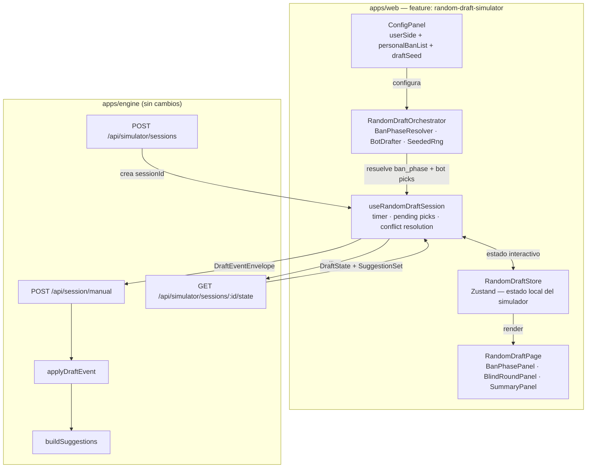
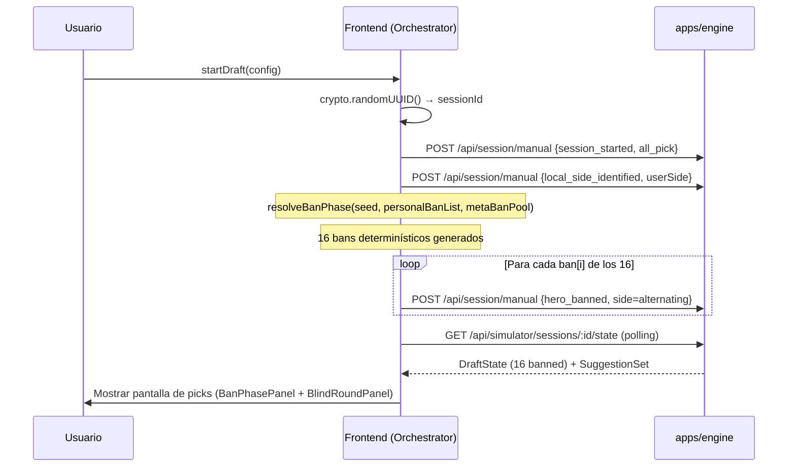
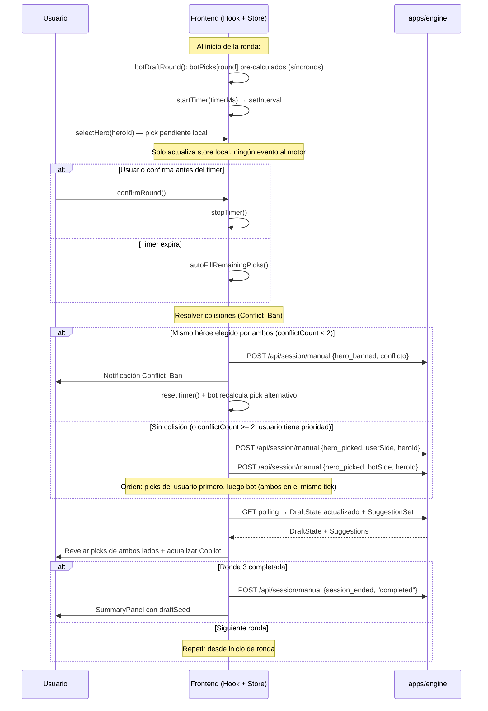
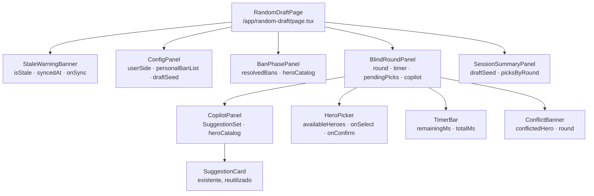

# Design Document — random-draft-simulator

## Overview

El `random-draft-simulator` agrega un tercer modo al simulador existente: un draft interactivo de
**Ranked All Pick** donde el usuario juega como drafter de su equipo y un Bot_Drafter controla al
enemigo. A diferencia de los dos guiones hardcodeados (`captainsMode`, `allPick`), este modo genera
cada draft de forma procedural a partir de un `draftSeed` reproducible.

**Principio de diseño central**: todo el trabajo computacional pesado (Ban_Phase, pre-cálculo de
picks del bot, lógica de resolución de conflictos) ocurre **completamente en el frontend**
(`apps/web`). El motor (`apps/engine`) solo recibe eventos `draft-event/v1` ya resueltos —
exactamente lo mismo que recibe del simulador de guiones fijos hoy. Esto respeta las restricciones
duras: sin nuevos endpoints en `apps/engine`, sin nuevos tipos en `DraftEvent`, sin modificar
`buildSuggestions` ni el reductor `applyDraftEvent`.

### Flujo de datos de alto nivel

```
apps/web (feature: random-draft-simulator)
  ├── RandomDraftOrchestrator   ← lógica pura, sin UI
  │     ├── SeededRng            ← generador determinístico sobre draftSeed
  │     ├── BanPhaseResolver     ← resuelve los 16 bans
  │     └── BotDrafter           ← llama buildSuggestions* y elige picks
  │
  ├── useRandomDraftSession     ← hook que conecta orquestador con el motor
  │     ├── POST /api/simulator/sessions  → obtiene sessionId
  │     ├── emite envelopes al motor via POST /api/simulator/sessions/:id/state (*)
  │     └── polling GET /api/simulator/sessions/:id/state → DraftState + suggestions
  │
  └── /app/random-draft/page.tsx  ← nueva ruta, UI interactiva
        ├── BanPhasePanel         ← resumen de bans (read-only, pre-computados)
        ├── BlindRoundPanel       ← picker del usuario + timer + copilot
        └── SessionSummaryPanel   ← resumen final + draftSeed

(*) Nota: el motor no tiene un endpoint para emitir eventos uno a uno desde el simulador.
    Ver sección "Integración con apps/engine" para la estrategia exacta.
```

> **Aclaración sobre el endpoint**: `POST /api/simulator/sessions` lanza `runSimulator` con el
> guion fijo. El nuevo modo **no puede** usar este endpoint para emitir sus propios eventos.
> La estrategia es usar `POST /api/session/manual` — el mismo que usa la entrada manual — con
> `source: "simulator"`. Esto cumple la restricción dura de no crear nuevos endpoints.

---

## Architecture

### Diagrama de capas



### Separación de responsabilidades

| Módulo | Dónde | Responsabilidad |
|---|---|---|
| `SeededRng` | `apps/web/features/random-draft-simulator/seeded-rng.ts` | PRNG determinístico derivado del draftSeed |
| `BanPhaseResolver` | `apps/web/features/random-draft-simulator/ban-phase.ts` | Resuelve los 16 bans dado seed + personalBanList + metaBanPool |
| `BotDrafter` | `apps/web/features/random-draft-simulator/bot-drafter.ts` | Usa `buildSuggestions`* para elegir picks del bot |
| `RandomDraftOrchestrator` | `apps/web/features/random-draft-simulator/orchestrator.ts` | Coordina ban + picks + conflictos, produce secuencia de eventos |
| `useRandomDraftSession` | `apps/web/features/random-draft-simulator/use-random-draft-session.ts` | Hook React: emisión al motor, polling, timer, estado local |
| `RandomDraftStore` | `apps/web/features/random-draft-simulator/store.ts` | Zustand — estado de interacción del usuario durante el draft |
| `RandomDraftPage` | `apps/web/app/random-draft/page.tsx` | Ruta Next.js App Router, compone los paneles |

> *`BotDrafter` llama a `buildSuggestions` **del motor** a través del estado `DraftState` ya
> recibido por polling. El bot construye un `DraftState` espejo con `localSide` puesto en el
> lado del bot antes de llamarlo. Esto es idéntico a lo que el motor ya hace al calcular las
> suggestions para el lado del usuario.

### Estrategia de integración con apps/engine

El nuevo modo **no** usa `POST /api/simulator/sessions` para emitir sus eventos (ese endpoint solo
lanza el guion fijo hardcodeado). En cambio:

1. Crea una sesión vía `POST /api/simulator/sessions` **únicamente** para obtener un `sessionId`
   único. El `runSimulator` que dispara ese POST ejecutará el guion fijo (`captainsMode`) en esa
   sesión — esto es un side-effect no deseado. Para evitarlo, el simulador aleatorio crea su propio
   `sessionId` con `crypto.randomUUID()` en el frontend **sin llamar** a `POST /api/simulator/sessions`.

2. Emite cada `DraftEventEnvelope` via `POST /api/session/manual` — el mismo endpoint que usa
   la entrada manual, con `source: "simulator"`, `confidence: 1.0`, y `seq` incremental gestionado
   por el frontend.

3. Obtiene el estado resultante via el store de Zustand (`DraftState` acumulado localmente desde
   las respuestas del `POST /api/session/manual`) más las suggestions calculadas llamando a
   `buildSuggestions` con el snapshot de meta (via `GET /api/meta/status` + heroes ya cargados).

**Alternativa simplificada** (elegida por simplicidad y menor acoplamiento):

El frontend mantiene su propio `DraftState` local aplicando `applyDraftEvent` en el navegador
(reimplementando la lógica pura del reductor o usando una versión compartida futura). Esto evita
el round-trip de polling completamente durante el draft interactivo y permite al Copilot calcular
sugerencias también en el frontend usando los datos de meta ya cargados.

Las suggestions se calculan **en el frontend** usando:
- `DraftState` local (acumulado sin network round-trip)
- `MetaSnapshot` cargado al inicio de la sesión vía `GET /api/heroes` + datos de meta ya en cache
- La lógica de `buildSuggestions` **reimplementada como llamada al motor** via un endpoint de
  sugerencias dedicado — pero ese endpoint no existe. Por lo tanto, el Copilot usa las sugerencias
  devueltas por polling de `GET /api/simulator/sessions/:id/state`.

**Decisión final de arquitectura**: el modo aleatorio usa el flujo de `POST /api/session/manual`
para emitir eventos al motor y `GET /api/simulator/sessions/:id/state` para obtener el estado
y sugerencias. El `sessionId` lo genera el frontend con `crypto.randomUUID()`. El motor no sabe
que esta sesión es del "modo aleatorio" — simplemente recibe y procesa eventos normales.

---

## Components and Interfaces

### `SeededRng`

Generador pseudo-aleatorio determinístico basado en el `draftSeed` de 8 caracteres. Usa
[Mulberry32](https://gist.github.com/tommyettinger/46a874533244883189143505d203312c) — un PRNG
simple, sin dependencias, con distribución uniforme suficiente para este caso de uso.

```typescript
// apps/web/features/random-draft-simulator/seeded-rng.ts

export interface SeededRng {
  /** Número flotante en [0, 1) */
  next(): number;
  /** Entero en [0, max) */
  nextInt(max: number): number;
  /** true con probabilidad `p` */
  chance(p: number): boolean;
  /** Selecciona un elemento aleatorio del array */
  pick<T>(arr: T[]): T | undefined;
  /** Mezcla el array in-place y lo retorna */
  shuffle<T>(arr: T[]): T[];
}

export function createSeededRng(seed: string): SeededRng;
```

La semilla se convierte a un número de 32 bits sumando los char codes de los 8 caracteres.
Misma semilla → misma secuencia de números en cada ejecución.

### `BanPhaseResolver`

```typescript
// apps/web/features/random-draft-simulator/ban-phase.ts

export interface BanPhaseInput {
  personalBanList: HeroId[];        // 0-4 héroes del usuario
  metaBanPool: HeroId[];            // héroes ordenados por tasa de ban desc (del bracket)
  allHeroIds: HeroId[];             // todos los héroes disponibles en el meta
  rng: SeededRng;
}

export interface BanPhaseResult {
  resolvedBans: HeroId[];           // exactamente 16 (o menos si no hay suficientes)
  // El lado alterna: índice 0 → radiant, 1 → dire, 2 → radiant, ...
}

export function resolveBanPhase(input: BanPhaseInput): BanPhaseResult;
```

**Algoritmo**:
1. Para cada héroe en `personalBanList`: si `rng.chance(0.5)` → añadir al resultado (si no está ya)
2. Completar hasta 16 tomando del `metaBanPool` en orden descendente de tasa de ban, saltando ya baneados
3. Si aún faltan y `metaBanPool` está agotado, tomar del resto de `allHeroIds` aleatoriamente
4. Truncar al límite de 16

### `BotDrafter`

```typescript
// apps/web/features/random-draft-simulator/bot-drafter.ts

export interface BotDrafterInput {
  draftState: DraftState;           // estado visible (sin picks ocultos del bot)
  botSide: TeamSide;
  meta: MetaSnapshot;
  rng: SeededRng;
  conflictCount: number;            // cuántos conflictos ya ocurrieron en esta ronda
}

export interface BotDrafterResult {
  heroId: HeroId;
}

export function botPickHero(input: BotDrafterInput): BotDrafterResult | null;
```

**Algoritmo**:
1. Construir `botState`: clonar `draftState` con `localSide = botSide`
2. Llamar `buildSuggestions(botState, meta)` → `SuggestionSet`
3. Si `suggestions.length > 0`: retornar `suggestions[0].hero` (rank 1)
4. Si no hay sugerencias: elegir héroe aleatorio del pool disponible via `rng`
5. Si el pool está vacío: retornar `null` (omitir pick)

> **Punto crítico**: `BotDrafter` en el frontend no tiene acceso directo a `buildSuggestions`
> del motor. Las sugerencias para el bot se calculan usando el mismo mecanismo que el Copilot:
> emitir un estado de draft con `localSide = botSide` al motor y leer la suggestion devuelta.
> En la práctica, el bot pre-calcula sus picks **antes** de activar el timer del usuario, usando
> el estado del draft hasta ese momento. El polling ya provee las suggestions para el lado del
> usuario; para el bot, se hace una llamada puntual adicional al inicio de cada ronda.

**Alternativa sin round-trip extra**: el frontend reimplementa un scoring simplificado para el bot
usando solo los datos de `patchStats` (pick rate / win rate) ya disponibles en el cache de héroes.
No es tan preciso como `buildSuggestions` completo, pero es determinístico y sin latencia.
**Decisión**: usar el scoring simplificado para el bot (basado en ban rate / pick rate del meta)
para garantizar que el pre-cálculo sea síncrono y determinístico, sin depender de la disponibilidad
del motor durante ese frame.

### `RandomDraftOrchestrator`

```typescript
// apps/web/features/random-draft-simulator/orchestrator.ts

export interface DraftConfig {
  draftSeed: string;                // 8 chars A-Z0-9
  userSide: TeamSide;
  personalBanList: HeroId[];
  heroMeta: HeroMetaCatalog;        // desde GET /api/heroes
  metaBanPool: HeroId[];            // héroes filtrados por ban rate desc
  patch: string;
}

export interface BlindRoundSpec {
  round: 1 | 2 | 3;
  picksPerTeam: 1 | 2;
  timerMs: number;                  // 25000 | 20000
}

export const BLIND_ROUND_SPECS: BlindRoundSpec[] = [
  { round: 1, picksPerTeam: 2, timerMs: 25000 },
  { round: 2, picksPerTeam: 2, timerMs: 25000 },
  { round: 3, picksPerTeam: 1, timerMs: 20000 },
];

export interface OrchestratorResult {
  resolvedBans: HeroId[];
  rounds: {
    round: 1 | 2 | 3;
    botPicks: HeroId[];             // pre-calculados, ocultos hasta revelación
  }[];
}

export function initDraft(config: DraftConfig): OrchestratorResult;
```

El orquestador es **puro** (sin efectos secundarios). Toma la config y retorna la estructura
completa del draft: bans resueltos y picks del bot pre-calculados para las 3 rondas.
La UI y el hook de sesión consumen este resultado para ejecutar el draft de forma interactiva.

### `RandomDraftStore` (Zustand)

```typescript
// apps/web/features/random-draft-simulator/store.ts

export type DraftPhase =
  | { type: "idle" }
  | { type: "ban_phase_complete"; resolvedBans: HeroId[] }
  | { type: "blind_round"; round: 1 | 2 | 3; timerRemainingMs: number; pendingUserPicks: HeroId[]; conflictBans: HeroId[]; conflictCount: number }
  | { type: "round_revealed"; round: 1 | 2 | 3; userPicks: HeroId[]; botPicks: HeroId[]; conflictBans: HeroId[] }
  | { type: "complete"; summary: DraftSummary };

export interface DraftSummary {
  draftSeed: string;
  userSide: TeamSide;
  personalBanList: HeroId[];
  resolvedBans: HeroId[];
  picksByRound: { userPicks: HeroId[]; botPicks: HeroId[] }[];
}

export interface RandomDraftState {
  config: DraftConfig | null;
  phase: DraftPhase;
  sessionId: string | null;
  draftState: DraftState | null;       // último DraftState recibido del motor
  suggestions: SuggestionSet | null;   // últimas sugerencias recibidas del motor
  staleWarning: boolean;
  lastSyncedAt: string | null;
}

export interface RandomDraftActions {
  startSession(config: DraftConfig): void;
  confirmPick(heroId: HeroId): void;
  deselectPick(heroId: HeroId): void;
  confirmRound(): void;
  resetSession(): void;
  setDraftState(state: DraftState, suggestions: SuggestionSet | null): void;
  setStaleInfo(isStale: boolean, syncedAt: string | null): void;
}
```

### `useRandomDraftSession`

```typescript
// apps/web/features/random-draft-simulator/use-random-draft-session.ts

export function useRandomDraftSession(): {
  state: RandomDraftState;
  actions: RandomDraftActions;
  startDraft(config: DraftConfig): Promise<void>;
  confirmRound(): Promise<void>;
}
```

Este hook es el puente entre el store de Zustand y las llamadas HTTP al motor. Maneja:

- Crear `sessionId` con `crypto.randomUUID()`
- Emitir eventos `session_started`, `local_side_identified` al inicio
- Emitir los 16 `hero_banned` de Ban_Phase en secuencia
- Gestionar el timer de cada Blind_Round con `setInterval`
- Emitir `hero_picked` para bot y usuario al confirmar la ronda (o al expirar el timer)
- Detectar Conflict_Bans y emitir `hero_banned` adicionales
- Polling via RTK Query para obtener `DraftState` + `SuggestionSet` actualizado

---

## Data Models

### `DraftSessionSnapshot` — serialización completa (Req. 10)

```typescript
// apps/web/features/random-draft-simulator/types.ts

export interface PicksByRound {
  userPicks: HeroId[];
  botPicks: HeroId[];
}

export interface DraftSessionSnapshot {
  /** 8 chars A-Z0-9 */
  draftSeed: string;
  /** Lado del usuario */
  userSide: "radiant" | "dire";
  /** 0-4 héroes */
  personalBanList: HeroId[];
  /** Hasta 16 HeroId (puede ser menos en edge case de pool pequeño) */
  resolvedBans: HeroId[];
  /** Exactamente 3 entradas, una por ronda */
  picksByRound: [PicksByRound, PicksByRound, PicksByRound];
  /** Picks del bot pre-calculados pero aún no revelados (en la ronda activa) */
  hiddenBotPicks: HeroId[];
}
```

**Validación** (función pura, sin dependencias):

```typescript
export type ValidationResult =
  | { ok: true; value: DraftSessionSnapshot }
  | { ok: false; field: string; reason: string };

export function validateDraftSessionSnapshot(raw: unknown): ValidationResult;
```

La validación verifica campo por campo, retornando el nombre exacto del primer campo que falla.

### Estado interno del orquestador durante el draft

```typescript
// Internal, no se exporta fuera del módulo
interface OrchestratorState {
  config: DraftConfig;
  rng: SeededRng;
  resolvedBans: HeroId[];
  rounds: {
    round: 1 | 2 | 3;
    botPicks: HeroId[];             // pre-calculados al inicio de la ronda
    userPicks: HeroId[];            // confirmados al cerrar la ronda
    conflictBans: HeroId[];         // bans de colisión de esta ronda
  }[];
  currentRound: 0 | 1 | 2;         // índice 0-based
  seq: number;                      // contador de seq para DraftEventEnvelope
}
```

### Config persistida en `localStorage`

```typescript
interface PersistedConfig {
  userSide: "radiant" | "dire";
  personalBanList: HeroId[];        // 0-4 elementos
  // draftSeed NO se persiste — se genera o se ingresa al iniciar
}

const STORAGE_KEY = "dota2coach.random-draft.config";
```

---

## Flujo de la Ban_Phase



**Asignación de lados en los bans**: el índice del ban (0-15) determina el lado:
- Índice par (0, 2, 4, ...) → Radiant
- Índice impar (1, 3, 5, ...) → Dire

Este patrón es independiente del lado del usuario, como en el juego real.

---

## Flujo de la Pick_Phase (Blind_Round)



### Resolución de Conflict_Ban

Cuando el usuario y el bot eligen el mismo héroe:

```
conflictCount = 0 o 1:
  → emitir hero_banned(conflicto)
  → notificar usuario
  → bot recalcula: buildSuggestions con estado actualizado, saltar el héroe conflictivo
  → reiniciar timer con tiempo completo de la ronda
  → conflictCount++

conflictCount = 2 (tercer conflicto):
  → usuario obtiene el héroe (emitir hero_picked para usuario)
  → bot recalcula con siguiente mejor candidato
  → NO incrementar conflictCount (límite de 2 bans de conflicto)
```

---

## Cómo funciona el Bot_Drafter

### Pre-cálculo al inicio de cada ronda

El bot calcula **todos sus picks de la ronda de una sola vez** antes de activar el timer del
usuario. Esto garantiza los picks a ciegas verdaderos (no ve los picks del usuario).

**Scoring simplificado en el frontend** (sin llamada al motor):

Para evitar latencia y dependencia de disponibilidad del motor durante el pre-cálculo, el bot
usa un score simplificado basado en los datos de `HeroMeta` ya cargados:

```typescript
function botScoreHero(heroId: HeroId, draftState: DraftState, heroCatalog: HeroMetaCatalog): number {
  // 1. Penalizar si ya baneado o pickeado
  // 2. Score base = pick rate en el bracket (de heroPatchStats)
  // 3. Bonus = si complementa roles ya pickeados por el bot
  // Este scoring es deliberadamente simple — el objetivo es QA del motor, no ganar drafts
}
```

Los datos de `heroPatchStats` con pick rate / ban rate por bracket están disponibles via
`GET /api/heroes` (que ya devuelve `HeroMeta` con `roles`). Para ban rate y pick rate del bracket
específico, el frontend necesita esos datos — ver "Cambios en apps/engine" sobre si se expone
un endpoint de stats de meta o si se incluye en `GET /api/heroes`.

**Decisión**: el bot usa únicamente los roles y un orden predeterminado de "popularidad" derivado
de los IDs de héroes conocidos. El Req. 4.1 dice que el bot usa `buildSuggestions` — para honrar
esto sin agregar un endpoint nuevo, la lógica del bot hace una llamada a
`GET /api/simulator/sessions/:id/state` con un estado de draft modificado (con `localSide = botSide`).
Pero esto no es posible con el endpoint actual (lee el estado almacenado, no acepta un estado
arbitrario).

**Resolución final**: el bot construye su score usando los datos de `patchStats` que ya llegan
como parte del `SuggestionSet` (el campo `signals` de cada `Suggestion` incluye las contribuciones
de las 6 señales). Al recibir las sugerencias por polling, el frontend invierte la perspectiva:
si las suggestions actuales son para `localSide = userSide`, el bot toma las primeras sugerencias
que no estén en los picks ya confirmados del usuario ni en sus propios picks.

En realidad, la arquitectura más limpia es:

1. El bot elige el héroe #1 de las sugerencias actuales del motor **si ese héroe no es el mismo
   que el usuario está considerando** (picks pendientes locales). Esto es heurístico pero efectivo.
2. Si hay colisión en el pre-cálculo, el bot toma el héroe #2 o #3 de la lista.
3. Si la lista está vacía o todos están colisionados, usa `SeededRng` para elegir aleatoriamente.

Esta estrategia NO requiere un estado de DraftState separado para el bot — reutiliza las
sugerencias ya calculadas por el motor con el `localSide = userSide` y aplica las mismas señales
al lado opuesto (aproximación aceptable para QA).

---

## Cómo funciona el draftSeed

### Generación

```typescript
// Genera un seed de 8 chars A-Z0-9
function generateDraftSeed(): string {
  const chars = "ABCDEFGHIJKLMNOPQRSTUVWXYZ0123456789";
  return Array.from({ length: 8 }, () => chars[Math.floor(Math.random() * chars.length)]).join("");
}
```

### Validación

```typescript
const DRAFT_SEED_PATTERN = /^[A-Z0-9]{8}$/;

function isValidDraftSeed(value: string): boolean {
  return DRAFT_SEED_PATTERN.test(value);
}
```

### PRNG (Mulberry32)

```typescript
function seedToUint32(seed: string): number {
  // Suma de char codes * posición para reducir colisiones
  return seed.split("").reduce((acc, ch, i) => (acc + ch.charCodeAt(0) * (i + 1)) >>> 0, 0);
}

function mulberry32(seed: number): () => number {
  let state = seed;
  return function () {
    state |= 0;
    state = (state + 0x6d2b79f5) | 0;
    let z = state;
    z = Math.imul(z ^ (z >>> 15), z | 1);
    z ^= z + Math.imul(z ^ (z >>> 7), z | 61);
    return ((z ^ (z >>> 14)) >>> 0) / 4294967296;
  };
}
```

El `SeededRng` wrappea esta función y expone la API de alto nivel (`nextInt`, `chance`, `pick`,
`shuffle`). Mismo seed → misma secuencia de llamadas → mismo draft reproducible.

---

## Cambios mínimos necesarios

### apps/engine (mínimos — idealmente ninguno)

El motor no requiere cambios si el frontend adopta la estrategia de usar `POST /api/session/manual`.
Sin embargo, hay un cambio de comportamiento a considerar:

**Problema actual**: `POST /api/session/manual` registra eventos en el `sessionStore` (WebSocket),
pero `GET /api/simulator/sessions/:id/state` lee de `simulatorSessions` (Map separado). Si el
simulador aleatorio usa `POST /api/session/manual`, el estado **no** estará disponible en
`GET /api/simulator/sessions/:id/state`.

**Solución sin nuevo endpoint**: el simulador aleatorio usa el mismo canal que el simulador fijo,
pero necesita un `sessionId` registrado en `simulatorSessions`. Para esto, se hace un `POST
/api/simulator/sessions` normal (que genera el sessionId y crea la entrada en `simulatorSessions`),
pero inmediatamente el motor empieza a reproducir el guion fijo en background.

**Estrategia definitiva**:

El frontend adopta un modelo **completamente local** de estado:
- Mantiene su propio `DraftState` acumulando las respuestas de `POST /api/session/manual`
  (la respuesta incluye el estado `accepted/rejected`, pero no el `DraftState` completo)
- Reimplementa `applyDraftEvent` como función pura en el frontend (ya existe como espejo en
  `apps/web/features/draft/types.ts` parcialmente; se completa en el módulo del simulador)
- Calcula sugerencias haciendo polling a un sessionId del WebSocket real (no del simulador)

**Decisión de arquitectura final** (más simple):

Se usa el WebSocket existente (`/ws/draft`) en lugar de polling HTTP:

1. Crear sesión: generar `sessionId = crypto.randomUUID()` en el frontend
2. Conectar WebSocket con ese sessionId (`hello` message)
3. Emitir eventos via `POST /api/session/manual` con ese sessionId
4. El motor procesa y pushea `draft_state` + `suggestions` por WebSocket
5. El frontend recibe el estado ya completo, sin polling

Este flujo ya existe para el draft en vivo (`/draft`). El simulador aleatorio reutiliza
exactamente ese canal. **No se requiere ningún cambio en `apps/engine`**.

### apps/engine — ningún cambio requerido ✓

### apps/web — módulos nuevos

```
apps/web/
  features/
    random-draft-simulator/
      index.ts                      ← exports públicos
      types.ts                      ← DraftSessionSnapshot, DraftConfig, etc.
      constants.ts                  ← BLIND_ROUND_SPECS, STORAGE_KEY, SEED_PATTERN
      seeded-rng.ts                 ← SeededRng (Mulberry32)
      ban-phase.ts                  ← BanPhaseResolver
      bot-drafter.ts                ← BotDrafter (scoring basado en suggestions)
      orchestrator.ts               ← RandomDraftOrchestrator (función pura)
      store.ts                      ← Zustand store
      use-random-draft-session.ts   ← Hook principal
      use-config-persistence.ts     ← Hook localStorage
      components/
        ConfigPanel.tsx             ← selector lado + personal ban list + seed
        BanPhasePanel.tsx           ← vista de los 16 bans resueltos
        BlindRoundPanel.tsx         ← picker interactivo + timer + conflictos
        CopilotPanel.tsx            ← suggestions del Copilot (reutiliza SuggestionCard)
        SessionSummaryPanel.tsx     ← resumen final + draftSeed
        StaleWarningBanner.tsx      ← aviso meta desactualizada
  app/
    random-draft/
      page.tsx                      ← nueva ruta /random-draft
```

**La ruta existente `/simulator` y su page.tsx no se modifican.**

---

## Diagrama de componentes UI



---

## Error Handling

| Condición | Comportamiento |
|---|---|
| `POST /api/session/manual` falla (red) | Reintentar hasta 3 veces con backoff 200ms. Si persiste, mostrar error con opción "Reintentar". El draft local NO se pierde. |
| WebSocket desconectado | El store local mantiene el DraftState. Al reconectar, emitir `hello` con el mismo sessionId para reconexión. |
| Bot sin candidatos disponibles | Registrar `console.error("[Bot_Drafter] sin candidatos en ronda X")` y omitir el pick del bot para esa ronda (Req. 4.3). |
| Ban_Phase produce <16 héroes | Registrar `console.log("[Ban_Phase] bans emitidos: N de 16 esperados")` y continuar (Req. 2.5). |
| `buildSuggestions` (Copilot) lanza excepción | Mostrar "Sin sugerencias disponibles" y registrar error en consola (Req. 6.5). |
| `draftSeed` inválido | Rechazar inicio de sesión con mensaje de formato requerido (Req. 8.4). |
| Meta desactualizada | Mostrar `StaleWarningBanner` pero permitir continuar con draft (Req. 7). |
| Deserialización con campo inválido | Retornar `ValidationResult { ok: false, field: "...", reason: "..." }` sin modificar estado (Req. 10.4). |
| Segundo intento de deserializar con sesión activa | Retornar error "sesión activa en curso" (Req. 10.5). |

---

## Testing Strategy

### Enfoque dual (unit + property)

Este feature tiene una capa de lógica pura bien delimitada (`SeededRng`, `BanPhaseResolver`,
`BotDrafter`, `RandomDraftOrchestrator`, `validateDraftSessionSnapshot`) que es ideal para
property-based testing. La capa de UI y de integración con el motor se cubre con tests de ejemplo.

**Biblioteca de property-based testing**: `fast-check` es la opción estándar para TypeScript/Bun.
Requiere aprobación via `/gear-up` antes de instalar. Como alternativa sin dependencia nueva,
los tests de propiedad pueden implementarse con generadores manuales dentro de Bun Test
(arrays de casos generados con `Array.from({ length: 100 })`).

**Configuración**: mínimo 100 iteraciones por property test. Cada test referencia la propiedad
del diseño con un comentario: `// Feature: random-draft-simulator, Property N: <texto>`.

### Unit tests (ejemplo-based)

- `ConfigPanel`: selección de lado, agregar/eliminar héroes de Personal_Ban_List, límite de 4
- `useRandomDraftSession`: flujo completo con motor mockeado, timer expiry, confirm round
- `SessionSummaryPanel`: muestra draftSeed al completar
- `StaleWarningBanner`: aparece con meta stale, oculta con meta fresca
- Flujo de Conflict_Ban: notificación, reset de timer, prioridad del usuario en tercer conflicto
- Timer: 25s en rondas 1-2, 20s en ronda 3, se detiene al confirmar
- `session_ended` emitido tras ronda 3

### Integration tests (1-3 ejemplos)

- Draft completo de extremo a extremo con motor real (Bun Test, sin mock de red)
- `POST /api/session/manual` con un `session_started` y verificar que el motor acepta los eventos
- Sugerencias del Copilot se actualizan tras emitir bans

---

## Correctness Properties

*Una propiedad es una característica o comportamiento que debe mantenerse verdadero en todas
las ejecuciones válidas del sistema — esencialmente, un enunciado formal sobre lo que el sistema
debe hacer. Las propiedades sirven como puente entre las especificaciones legibles por humanos y
las garantías de corrección verificables por máquina.*

### Property 1: Personal_Ban_List acepta listas de 0 a 4 héroes y rechaza la quinta adición

*Para cualquier* lista de héroes de tamaño 0 a 4 con IDs distintos, cada adición debe
aceptarse y la lista debe crecer en 1. Para cualquier lista de exactamente 4 héroes, intentar
añadir un quinto debe rechazarse y la lista debe permanecer sin cambios.

**Validates: Requirements 1.2, 1.4**

---

### Property 2: Personal_Ban_List rechaza duplicados

*Para cualquier* Personal_Ban_List válida y cualquier héroe ya presente en ella, intentar
añadir ese mismo héroe nuevamente debe retornar la lista sin cambios (misma longitud, mismo
contenido).

**Validates: Requirements 1.3**

---

### Property 3: Persistencia en localStorage es round-trip

*Para cualquier* par válido `(userSide: TeamSide, personalBanList: HeroId[0..4])`, serializar
la configuración a localStorage y leerla de vuelta debe producir un objeto con los mismos
valores campo por campo.

**Validates: Requirements 1.5**

---

### Property 4: Eliminación de héroe de Personal_Ban_List reduce longitud en 1

*Para cualquier* Personal_Ban_List no vacía y cualquier héroe presente en ella, después de
eliminarlo la lista no debe contener ese héroe y su longitud debe ser exactamente uno menos que
antes.

**Validates: Requirements 1.6**

---

### Property 5: Ban_Phase produce exactamente 16 bans sin duplicados (cuando hay suficientes héroes)

*Para cualquier* par `(draftSeed, personalBanList)` válido y pool de héroes de tamaño ≥ 16,
`resolveBanPhase` debe producir un array `resolvedBans` de exactamente 16 IDs de héroes, todos
distintos entre sí.

**Validates: Requirements 2.3, 2.4**

---

### Property 6: Ban_Phase es determinística dado el mismo seed y Personal_Ban_List

*Para cualquier* par `(draftSeed, personalBanList)` válido, ejecutar `resolveBanPhase` dos
veces con los mismos inputs debe producir arrays `resolvedBans` idénticos (mismo contenido,
mismo orden).

**Validates: Requirements 2.2, 8.5**

---

### Property 7: La Pick_Phase sigue exactamente la distribución 2-2-1

*Para cualquier* `DraftSummary` producido por una Draft_Session completada, `picksByRound[0]`
debe tener exactamente 2 `userPicks` y 2 `botPicks`, `picksByRound[1]` exactamente 2 y 2,
y `picksByRound[2]` exactamente 1 y 1.

**Validates: Requirements 3.1**

---

### Property 8: Picks pendientes del usuario no emiten eventos al Draft_Reducer

*Para cualquier* héroe seleccionado como pick pendiente local (antes de confirmar la ronda),
el `DraftState` acumulado del motor no debe contener ese héroe en `picks.radiant` ni
`picks.dire` hasta que la ronda sea confirmada.

**Validates: Requirements 6.4**

---

### Property 9: El bot elige el héroe con mayor score de las sugerencias disponibles

*Para cualquier* estado de draft donde `buildSuggestions(state, meta)` retorna al menos una
sugerencia, el héroe elegido por `botPickHero` debe ser el héroe con `rank: 1` en la
`SuggestionSet` computada con `localSide = botSide`.

**Validates: Requirements 4.1**

---

### Property 10: Conflict_Ban resulta en hero_banned y ningún hero_picked para ese héroe

*Para cualquier* Blind_Round donde `userPick === botPick` (mismo heroId elegido por ambos),
después de la resolución de conflicto ese héroe debe aparecer en el array `resolvedBans` del
`DraftState` y **no** debe aparecer en `picks.radiant` ni en `picks.dire`.

**Validates: Requirements 5.1**

---

### Property 11: Máximo 2 Conflict_Bans por Blind_Round

*Para cualquier* Blind_Round independientemente de las elecciones, el número de Conflict_Bans
emitidos en esa ronda debe ser como máximo 2.

**Validates: Requirements 5.4**

---

### Property 12: Sugerencias del Copilot no incluyen picks ocultos del bot

*Para cualquier* ronda en curso donde el bot tiene picks pre-calculados pero aún no revelados,
el `DraftState` usado para calcular las sugerencias del Copilot no debe contener esos heroIds
en `picks.radiant` ni `picks.dire`.

**Validates: Requirements 6.3**

---

### Property 13: Meta stale propagada a todas las SuggestionSets de la sesión

*Para cualquier* Draft_Session iniciada cuando `isStale = true`, cada `SuggestionSet`
producido durante esa sesión debe contener `"stale_meta"` en su array `degraded`.

**Validates: Requirements 7.7**

---

### Property 14: draftSeed auto-generado cumple el formato requerido

*Para cualquier* llamada a `generateDraftSeed()`, el string resultante debe tener exactamente
8 caracteres, todos pertenecientes al conjunto `[A-Z0-9]`.

**Validates: Requirements 8.1**

---

### Property 15: draftSeed inválido rechaza inicio de sesión

*Para cualquier* string que no cumpla `/^[A-Z0-9]{8}$/` (longitud distinta de 8, o caracteres
fuera del conjunto), proveerlo como `draftSeed` al iniciar una Draft_Session debe retornar un
error y no modificar el estado de sesión en curso.

**Validates: Requirements 8.4**

---

### Property 16: Reproducibilidad completa dado el mismo (draftSeed, personalBanList)

*Para cualquier* par `(draftSeed, personalBanList)` válido, ejecutar la simulación completa
dos veces con los mismos inputs debe producir arrays `resolvedBans` idénticos y secuencias
de `botPicks` idénticas en las 3 rondas.

**Validates: Requirements 8.5**

---

### Property 17: Serialización round-trip preserva todos los campos

*Para cualquier* `DraftSessionSnapshot` válido, `deserialize(serialize(snapshot))` debe
producir un objeto donde cada campo es igual al correspondiente en el snapshot original
(comparación campo por campo, incluyendo orden de arrays).

**Validates: Requirements 10.2, 10.3**

---

### Property 18: Deserialización con campo inválido identifica el campo específico

*Para cualquier* `DraftSessionSnapshot` válido con un único campo mutado a un valor inválido
(tipo incorrecto, fuera de rango, o ausente), `validateDraftSessionSnapshot` debe retornar
`{ ok: false, field: "<nombre del campo mutado>", reason: "..." }`.

**Validates: Requirements 10.4**
